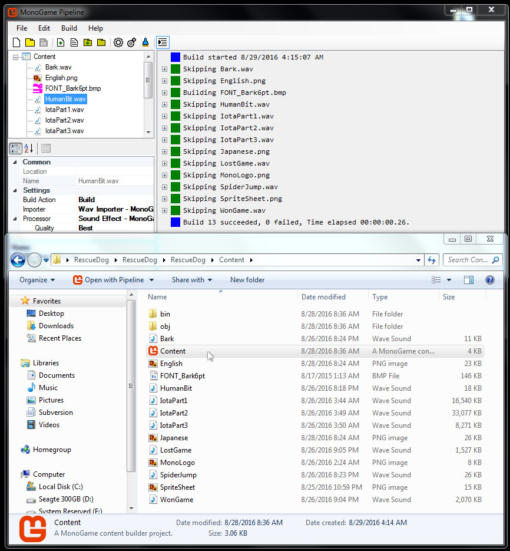
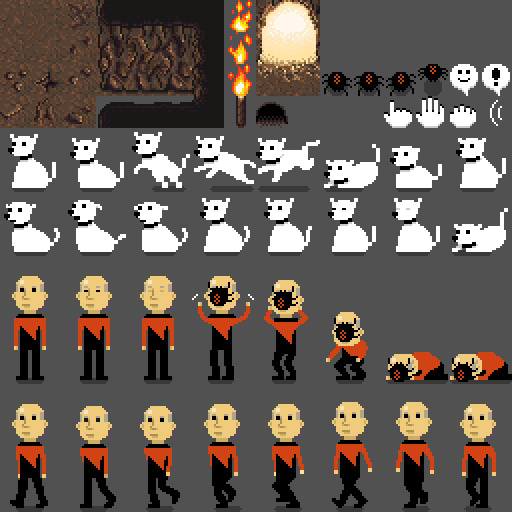

# Asset Planning

In this article, we will discuss planning a game's assets.

Let's get started.

### What is a Game Asset?

A Game Asset refers to any model, image, texture, sound, effect, animation, or dialog used in a game.

This could also include storylines, interfaces, or any other crafted item created by a human.

Generally, game assets are things created by humans for use in a game.

### What Assets does the Example Game have?

The example game, RescueDog, has **13 game assets:**

3 sprite sheets

1 image

1 font

3 background music tracks

3 actor sound effects

2 event sound effects

The game's assets are displayed below. Note the monogame content pipeline tool.

### Planning a Game's Assets

Planning a game's assets can be a monumental task.

For every actor or hero in your game you need a visual and auditory representation.

Visually, this may be a model with a texture, or a sprite, or simply a text letter or number.

That actor or hero also needs at least one signature sound - maybe that's just an attack sound.

Maybe it's a sound for selecting the actor, for the actor dying, leveling up, etc...

Each actor likely also has animations. Maybe that's just an attack animation and a walk cycle.

Or maybe they can block attacks, duck and dodge, jump and climb. Each animation is an asset!

And this actor likely exists in a world or level. That level will need art and level design.

But you're not done yet - maybe that level also needs sound. Is it raining? Does a volcano explode?

Perhaps the level also needs animation. Does that door open? Does that wall crumble?

Then you must consider the assets necessary to tell the game's story - dialogs, cutscenes, images.

How does the user interact with the game? Through a user interface - that needs to be designed too.

How you determine and design the game's assets will have a huge effect on the game's scope.

The more numerous, detailed, and varied the assets are - the more work will be required to create them.

### Creating The Example Game's Assets

Creating the example game's assets took a significant amount of time.

[Cave tiles](http://opengameart.org/content/cave-tileset-0) from OpenGameArt.org were chosen for the level sprites.

Each actor's sound effect was created using the tool [BFXR](http://www.bfxr.net/).

Photoshop was used to create and pack the game's two main sprite sheets.

Each actor was limited to an animation facing one direction. 

Then the sprite was flipped horizontally when the actor moved the opposite direction.

Take a look at the actor and level sprite sheet the game uses:

### Summary

We discussed what Game Assets are and explored the assets in the example game, RescueDog.

You should have an understanding of how to plan a game's assets.

