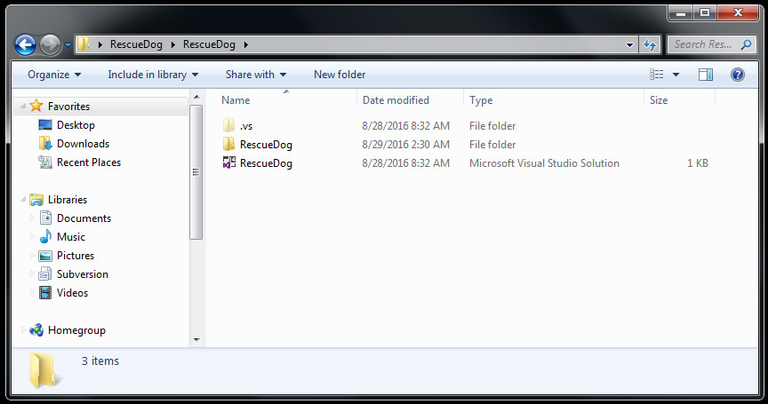

# Building An Example Game

In this article, we will download, build, and play an example game.

This article assumes that you have completed all previous articles.

Let's get started.

### Download the Example Game Archive

Right-click and save the following archive to your computer.

[RescueDog Game Archive (59MB)](../Assets/RescueDog.rar)

Decompress the archive into a folder, then navigate to the project directory.

Double-click the RescueDog solution file to open it in your IDE.

Once opened, check to see if any errors have been generated.

Hopefully, there are no errors. Now you can build the project.

Press F5 to build and run the project.

You should get a window similar to below.

For now, just play around with the game to get a feel for it.

In this game, you control a bouncy happy dog lost in a cave.

You can move with the arrow keys, or WASD keys, or a gamepad.

Press spacebar or press the A button on the gamepad to make the dog bark.

The goal of the game is to lead your human to the cave's exit.

Along the way, you'll encounter spiders that can bite your human.

You'll want to bark at the spiders to scare them away.

If your human gets bit, you'll lose the game.

### Summary

In this article we downloaded a game's source code and opened it in our IDE.

Then we built the game's source code into an executable file and play tested the game.

Next we'll begin deconstructing the game's design and codebase.

