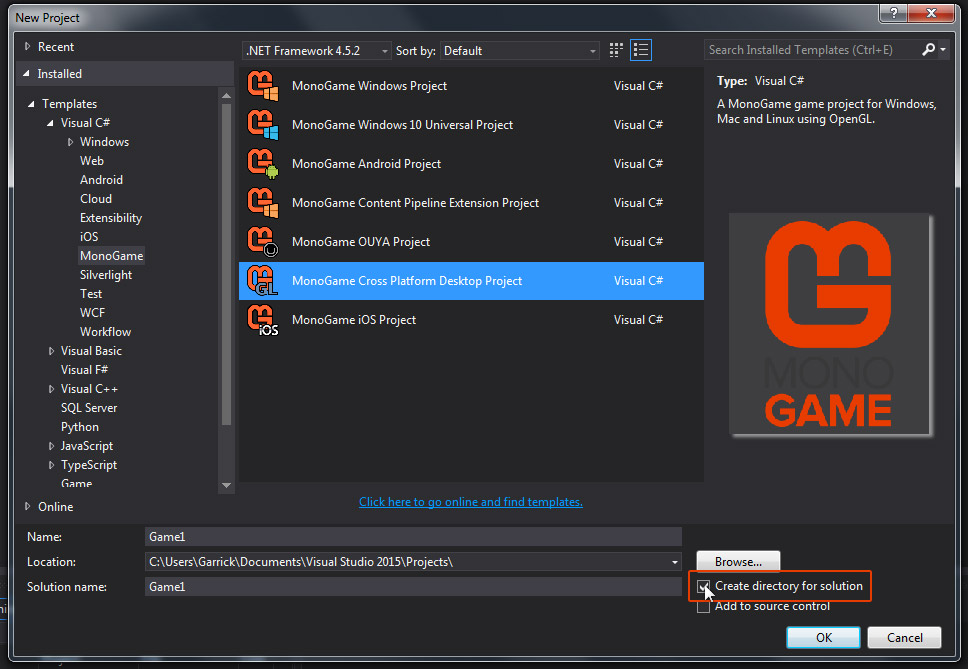
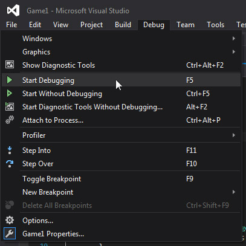
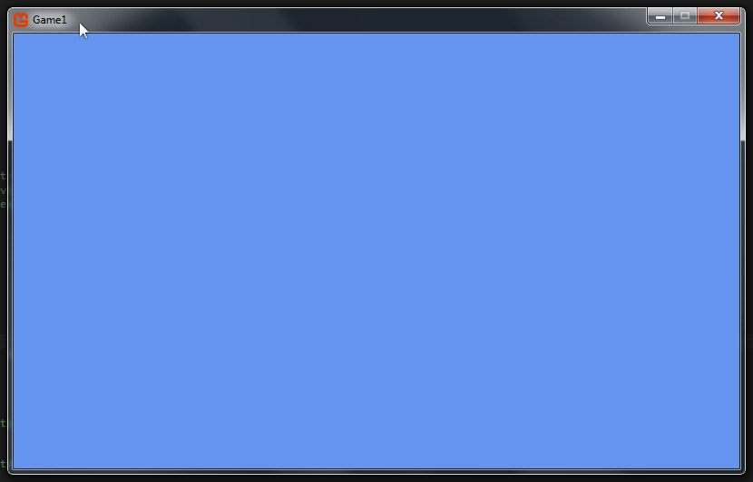

# Building A MonoGame Project

Launch your IDE and choose 'New Project'.

Look for the Monogame project template and select it.

Choose the project type that works for the platform you want to target.

Choose a location for your project.

Make sure 'create directory for solution' is checked, then click OK.

Now press the F5 key to build and run the project.

You can alternatively run the project through the top menu by clicking Debug > Start Debugging.

After a moment, a blue window will appear.

### Summary

**Congratulations!**

You have built and run your very first monogame project.

You can close the game window by clicking the close x button or by pressing escape on your keyboard.

If you have a gamepad connected to your computer, you can press the back button to exit.

