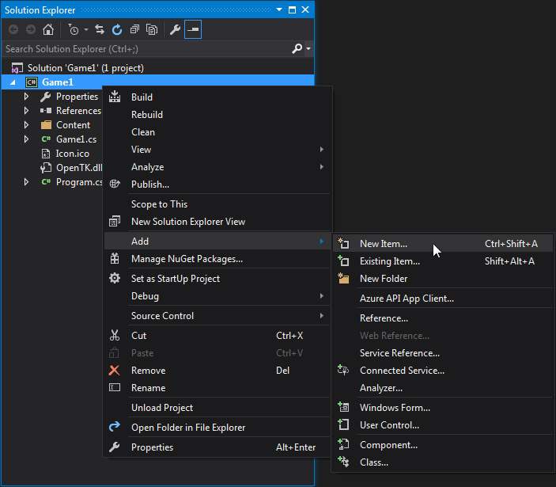
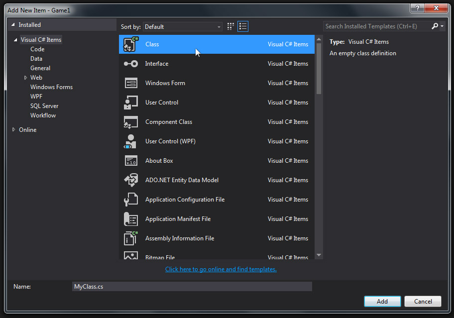
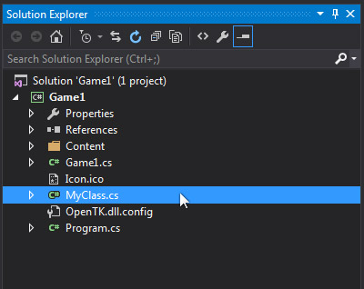
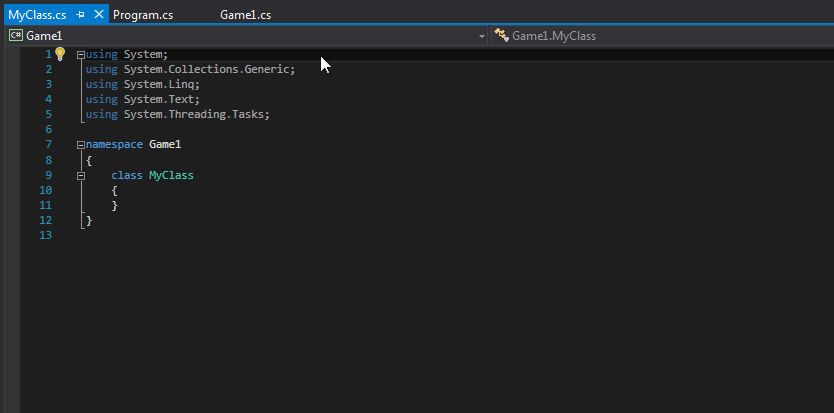
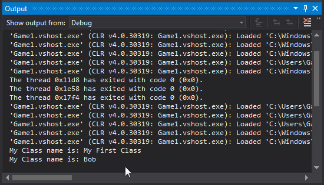

# Creating a New Class


In this article, we will examine how to create a new class in your project.

This article assumes that you have already [Built A MonoGame Project](BuildingFirstProject.md).

Let's get started.


### Adding a New Item


Right-click Game1 in your solution explorer.

Navigate to Add > New Item... and click.


<center></center>


A new window appears.

Here is where you choose what type of new item you want to add to your project.

Choose the **Class item type**, change the Name property to **MyClass.cs**, then click Add.


<center></center>


### Editing Your New Class


In your solution explorer window, a new class named MyClass.cs has been added.

Select it by double-clicking on the MyClass.cs name.


<center></center>


Your new class MyClass.cs appears in the Editor window.


<center></center>


Let's edit MyClass to have a variable and a method.

Copy and paste the code below into MyClass.cs


```cs
using System;
using System.Collections.Generic;
using System.Linq;
using System.Text;
using System.Threading.Tasks;

namespace Game1
{
    public class MyClass
    {
        public string name;

        public MyClass()
        { name = "My First Class"; }

        public void ChangeName(string newName)
        { name = newName; }
    }
}
```	


We have added a string variable called **name** to MyClass.cs.

We have created a constructor method called **MyClass()** which sets the variable **name** to "My First Class".

Finally, we have created a method called **ChangeName()** which accepts a string parameter.

The passed string parameter is used to set the **name** variable.


### Adding Your New Class to Game1


Now let's add our new class MyClass.cs to Game1.

Double-click Game1.cs in the solution explorer to open it in the Editor.

Replace Game1's source code with the code below.


```cs
using Microsoft.Xna.Framework;
using Microsoft.Xna.Framework.Graphics;
using Microsoft.Xna.Framework.Input;

namespace Game1
{
    public class Game1 : Game
    {
        GraphicsDeviceManager graphics;
        SpriteBatch spriteBatch;

        MyClass myNewClass;

        public Game1()
        {
            graphics = new GraphicsDeviceManager(this); Content.RootDirectory = "Content";
        }
        protected override void Initialize() { base.Initialize(); }
        protected override void LoadContent()
        {
            spriteBatch = new SpriteBatch(GraphicsDevice);

            myNewClass = new MyClass();
            System.Diagnostics.Debug.WriteLine("My Class name is: " + myNewClass.name);

            myNewClass.ChangeName("Bob");
            System.Diagnostics.Debug.WriteLine("My Class name is: " + myNewClass.name);
        }
        protected override void UnloadContent() {}
        protected override void Update(GameTime gameTime) { base.Update(gameTime); }
        protected override void Draw(GameTime gameTime)
        {
            GraphicsDevice.Clear(Color.CornflowerBlue); base.Draw(gameTime);
        }
    }
}
```	


Run your game by pressing F5.
Locate the output window and inspect it.
Your output window should look like below.


<center></center>


### Inspect Game1.cs


In Game1, we defined a new instance of MyClass, named **myNewClass**.

Then we modified the LoadContent() method to actually create myNewClass.

As soon as we make the call to create myNewClass, it's constructor method is called.


We check that the constructor method has been called by writing the class member name to the output window.

This is done by using the command **System.Diagnostics.Debug.WriteLine()**.

We pass a string to this command, along with our class member name.

The result of this command is the output "My Class name is: My First Class".


Next, we call the ChangeName() method of myNewClass, and we pass it the string parameter of "Bob".

Our instance myNewClass changes it's name member to match our passed string "Bob".

We check that this change has occurred by writing the class member name to the output window again.

This time the output result is "My Class name is: Bob".


These commands occur in the LoadContent() method shown below.


```cs
protected override void LoadContent()
{
	spriteBatch = new SpriteBatch(GraphicsDevice);

	myNewClass = new MyClass();
	System.Diagnostics.Debug.WriteLine("My Class name is: " + myNewClass.name);

	myNewClass.ChangeName("Bob");
	System.Diagnostics.Debug.WriteLine("My Class name is: " + myNewClass.name);
}
```		


### Summary


You added a new class called MyNewClass to your project. 

Then you modified your new class to have a variable, a constructor, and a method.

You then created an instance of your new class in Game1 and called one of the classes methods.


Then you inspected your class instance via the output console using the **WriteLine** command.

**You will be adding, modifying, creating, and inspecting many classes as you develop your game.**

Therefore, it is necessary to have a solid understanding how to do so.


