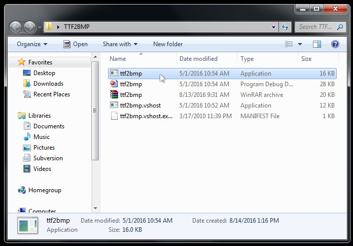
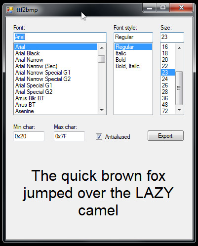
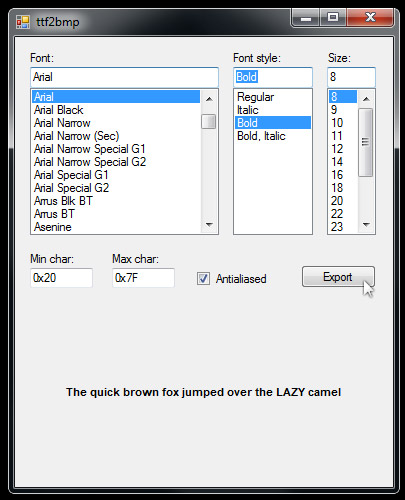
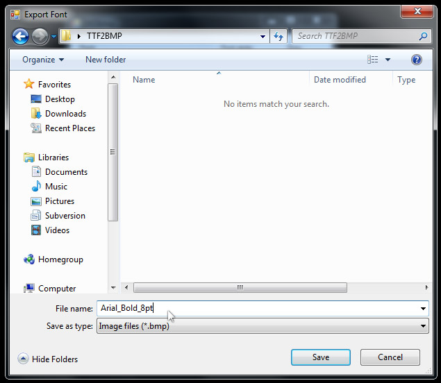
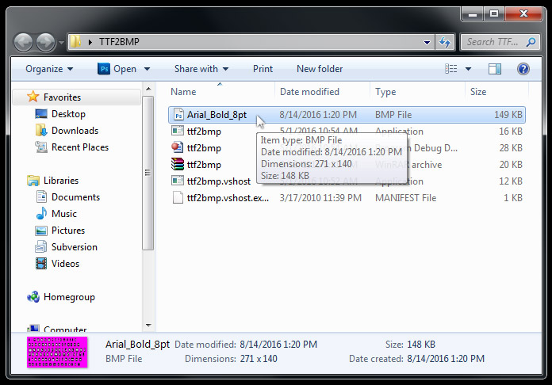
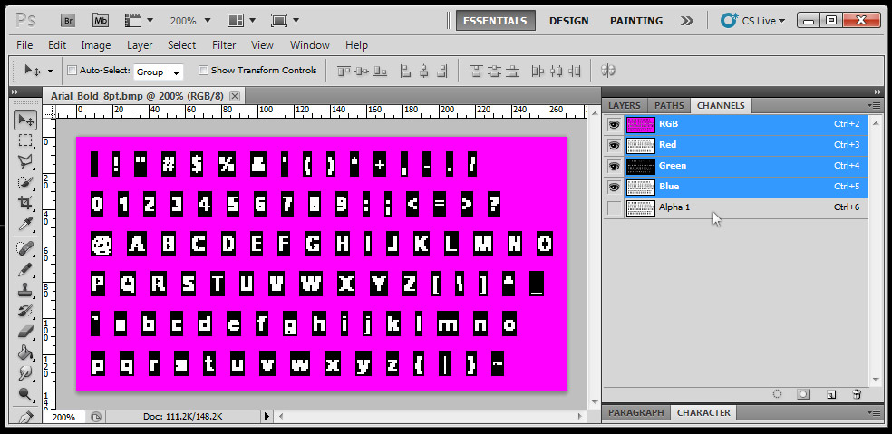
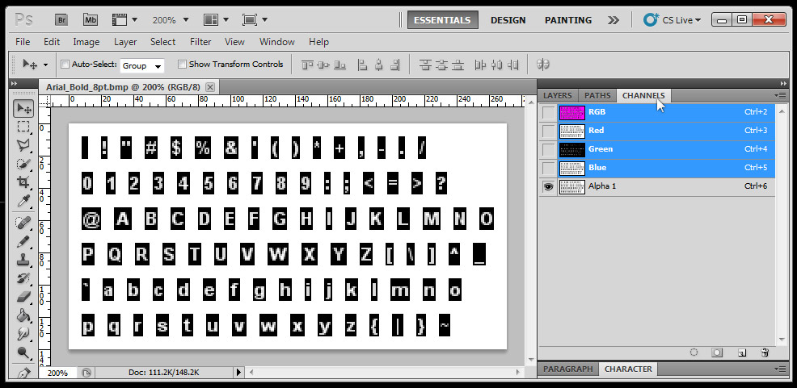

# Creating a Bitmap SpriteFont

In this article, we will create a Bitmap SpriteFont from a TrueType Font using a tool called "TTF2BMP".

This article assumes you have completed the **Textures** and **Fonts** tutorials.

Let's get started.

### Download the TTF2BMP Tool

TTF2BMP is a free program that converts True Type Fonts to a Bitmap Font file that Monogame can compile and use.

Click the link below to download an archive containing TTF2BMP.

[ttf2bmp.rar](../Assets/ttf2bmp.rar)

### Using TTF2BMP

First you'll need to unpack the rar archive. 

Use WinRar or whatever tool you have available.

Then locate the application (.exe) and double-click it.

The program launches, and looks like the image below.

Choose the font you want to export from the list of fonts installed on your system.

Set the font weight and point size.

If you require certain characters to be available, you may need to change the min/max character values.

The default values will export uppercase + lowercase letters, numbers, and basic punctuation and brackets.

You can toggle anti-aliasing on and off.

When you have setup your export options, click the export button.

Locate the directory you want to save the exported BMP font to.

**It is important that you name the font appropriately**, so you or someone else can tell what the font is at a glance.

For example, I named the exported font "**Arial_Bold_8pt**" so I know the font, weight, and size.

You can name it anything you want, but reconsider names like "**TotallySweetFont**" or "**GameFont**".

It's likely you won't remember the font, weight, or size, in a month.

Click the save button once you've decided on a name.

Finally, navigate to the directory you exported the Bitmap to.

It's easy to find the font bitmap because it will have a weird neon pink background.

### You're done!

At this point, the Bitmap SpriteFont is ready to be added to your project's pipeline.

See the article [Adding a Bitmap SpriteFont](FontAddingSpritefont.md) for a tutorial on how to do so.

### Inspecting the Bitmap SpriteFont

If you're curious about what this Bitmap Spritefont visually contains, open the BMP file in an image editor, like Photoshop.

Each letter is seperated by a pure magenta color.

The alpha channel is used to specify which areas should be solid or transparent.

The alpha in the magenta border region must be set to fully opaque.

You can create your own fonts if you follow the pattern of characters presented in these bitmap images.

### Summary

You should now understand how to use TTF2BMP to export Bitmap SpriteFont files for use with Monogame.

