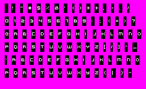
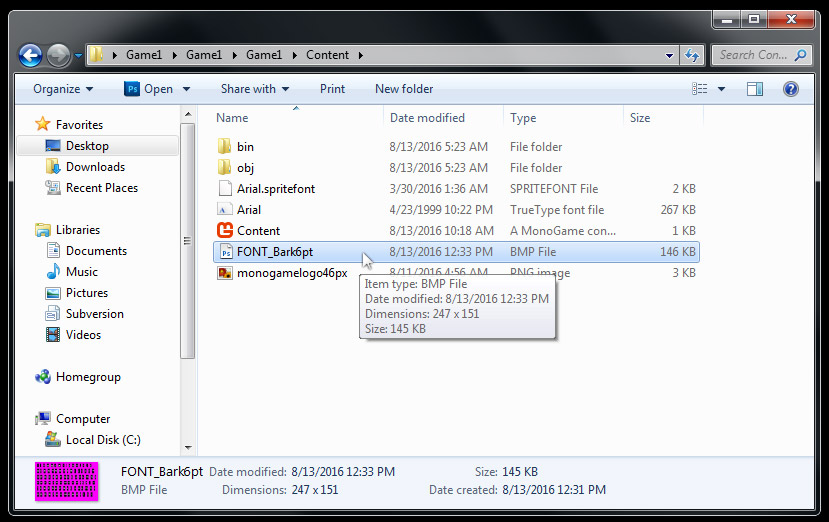
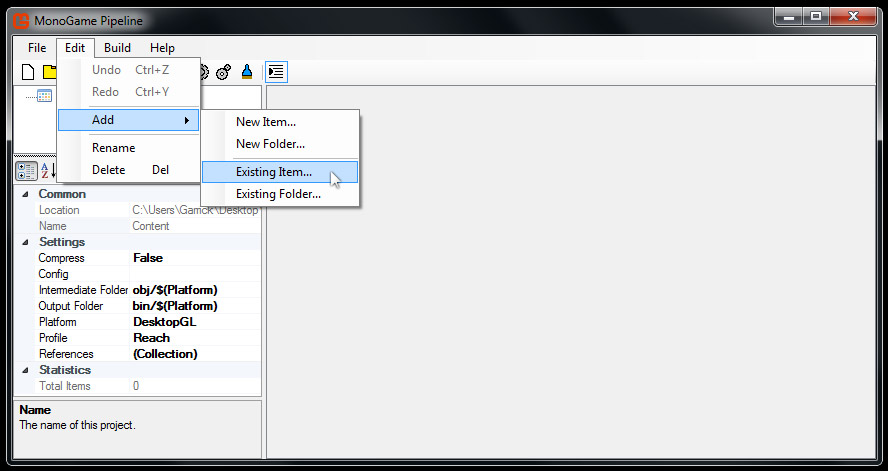
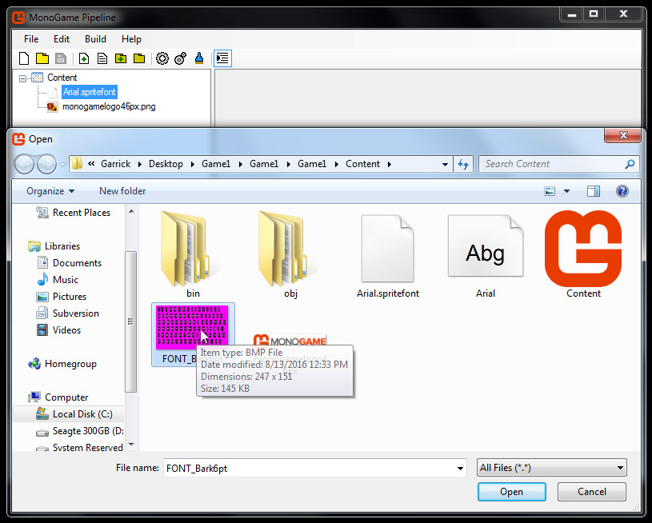
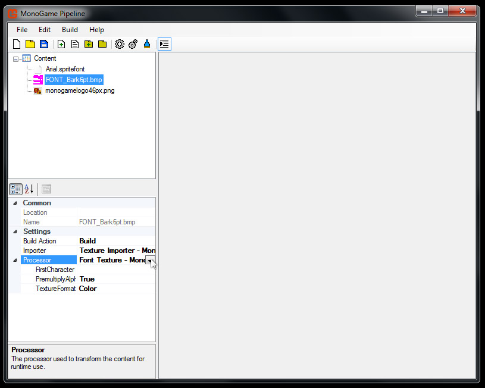
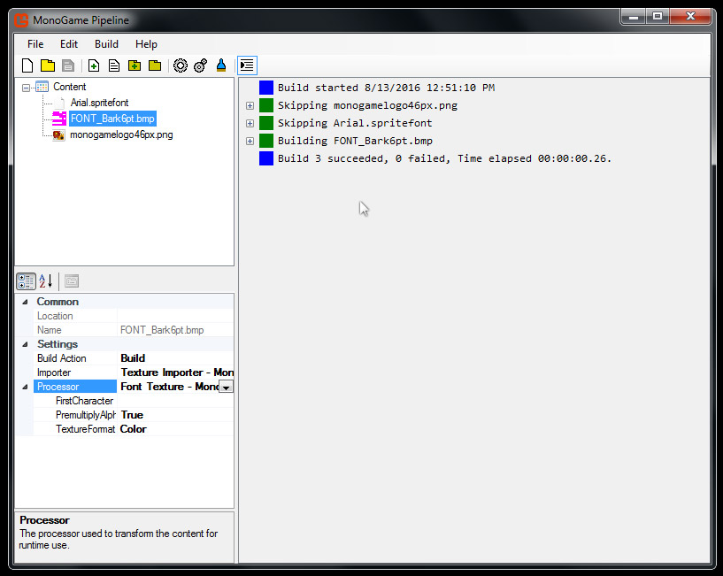

# Adding a Bitmap Spritefont

In this article, we will add a Spritefont Bitmap asset to your game's pipeline tool, and build the asset into a XNB.

This article assumes that you have completed the **Textures** tutorials.

Let's get started.

### Copy the Bitmap Spritefont Asset

First, you'll need to download the Bitmap Spritefont image below. 

Right click the image and choose 'Save As...' then save it to your project's Content folder.

Make sure you save it with the .BMP file extension.

### Launch the Pipeline Tool

Navigate to your project's Content folder and double click on Content.mgcb.

### Add the Bitmap Spritefont Asset

Now we will add our downloaded Bitmap Spritefont to the pipeline tool.

Click Edit > Add > Existing Item...

Locate the downloaded Bitmap in the file browser.

Double click the Bitmap, or click the 'open' button.

The bitmap spritefont will be added to the pipeline project.

Locate the **Processor** option in the bottom left hand corner.

Set this option to **Font Texture** from the drop down.

Save and build your pipeline project.

### Summary

You added a bitmap spritefont to your pipeline project.

Then the bitmap spritefont was built into a XNB.

The next step is to load and draw the font in your game.

We'll cover this in the next article [Drawing Text](FontDrawing.md).

