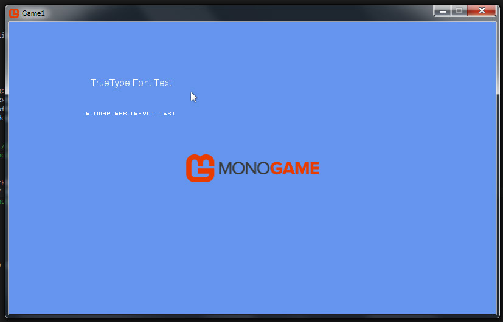
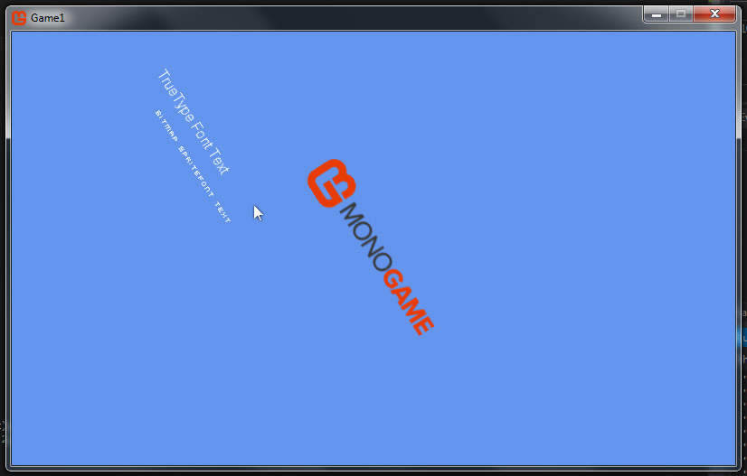
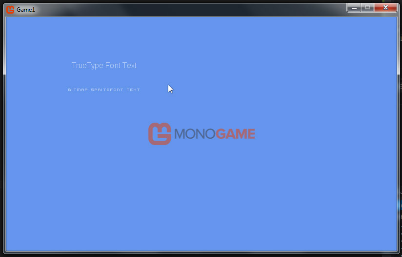
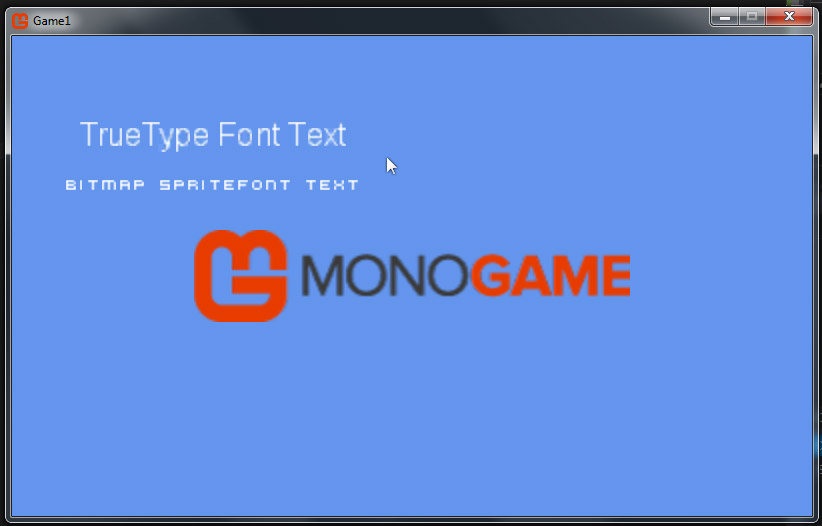
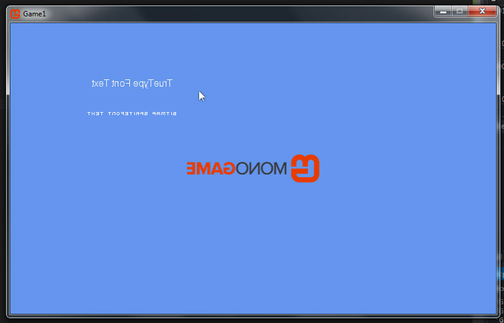

# Modifying Text


In this article, we will modify the appearance of our fonts.

This article assumes you have completed [Drawing Text](FontDrawing.md).

Let's get started.


### Update Game1.cs


Replace all the code in Game1.cs with the code below.


```cs
using Microsoft.Xna.Framework;
using Microsoft.Xna.Framework.Graphics;
using Microsoft.Xna.Framework.Input;

namespace Game1
{
    public class Game1 : Game
    {
        GraphicsDeviceManager graphics;
        SpriteBatch spriteBatch;

        Texture2D texture;
        Vector2 position;
        Rectangle drawRec;
        float alpha = 0.5f;
        float rotation = 0.0f;
        Vector2 origin = new Vector2(0,0);
        float scale = 1.0f;
        SpriteEffects spriteEffect = SpriteEffects.None;
        float zDepth = 0.1f;

        SpriteFont TTfont;
        Vector2 TTFposition = new Vector2(200, 100);
        Vector2 TTFOrigin;
        string TTFText = "TrueType Font Text";

        SpriteFont BitmapFont;
        Vector2 BitmapFontPosition = new Vector2(200, 150);
        Vector2 BMPOrigin;
        string BMPText = "Bitmap Spritefont Text";

        public Game1()
        {
            graphics = new GraphicsDeviceManager(this);
            Content.RootDirectory = "Content";
        }
        protected override void Initialize() { base.Initialize(); }

        protected override void LoadContent()
        {
            this.IsMouseVisible = true;
            spriteBatch = new SpriteBatch(GraphicsDevice);
            texture = Content.Load<Texture2D>(@"monogamelogo46px");
            drawRec = new Rectangle(0, 0, texture.Width, texture.Height);
            position = new Vector2(graphics.PreferredBackBufferWidth / 2, graphics.PreferredBackBufferHeight / 2);
            origin = new Vector2(texture.Width/2, texture.Height/2);

            TTfont = Content.Load<SpriteFont>("Arial");
            TTFOrigin = TTfont.MeasureString(TTFText) / 2; //get the middle point of the text
            TTFOrigin.X = (int)TTFOrigin.X; //convert to whole number
            TTFOrigin.Y = (int)TTFOrigin.Y;

            BitmapFont = Content.Load<SpriteFont>("FONT_Bark6pt");
            BMPOrigin = BitmapFont.MeasureString(BMPText) / 2; //get the middle point of the text
            BMPOrigin.X = (int)BMPOrigin.X; //convert to whole number
            BMPOrigin.Y = (int)BMPOrigin.Y;
        }
        protected override void UnloadContent() {}

        protected override void Update(GameTime gameTime)
        {
            if (Keyboard.GetState().IsKeyDown(Keys.Escape)) { Exit(); }
            base.Update(gameTime);
        }

        protected override void Draw(GameTime gameTime)
        {
            GraphicsDevice.Clear(Color.CornflowerBlue);
            spriteBatch.Begin();
            spriteBatch.Draw(   texture,
                                position,
                                drawRec,
                                Color.White * alpha,
                                rotation,
                                origin,
                                scale,
                                spriteEffect,
                                zDepth);

            spriteBatch.DrawString( TTfont,
                                    TTFText, 
                                    TTFposition, 
                                    Color.White * alpha, 
                                    rotation,
                                    TTFOrigin, 
                                    scale, 
                                    spriteEffect, 
                                    zDepth);

            spriteBatch.DrawString( BitmapFont,
                                    BMPText,
                                    BitmapFontPosition,
                                    Color.White * alpha,
                                    rotation,
                                    BMPOrigin,
                                    scale,
                                    spriteEffect,
                                    zDepth);

            spriteBatch.End();
            base.Draw(gameTime);
        }
    }
}
```	


### What's been Changed?


We've defined several variables to hold attributes of our two fonts.

Note each font has it's own position, origin, and string.


```cs
SpriteFont TTfont;
Vector2 TTFposition = new Vector2(200, 100);
Vector2 TTFOrigin;
string TTFText = "TrueType Font Text";

SpriteFont BitmapFont;
Vector2 BitmapFontPosition = new Vector2(200, 150);
Vector2 BMPOrigin;
string BMPText = "Bitmap Spritefont Text";
```	


We've updated LoadContent() to modify these new variables.

Note that we convert the origin values to whole numbers to ensure each font's sharpness and legibility.

Recall that you should **always draw a font's position with whole numbers.**

This rule **also applies to the font's origin.**


```cs
TTfont = Content.Load<SpriteFont>("Arial");
TTFOrigin = TTfont.MeasureString(TTFText) / 2; //get the middle point of the text
TTFOrigin.X = (int)TTFOrigin.X; //convert to whole number
TTFOrigin.Y = (int)TTFOrigin.Y;

BitmapFont = Content.Load<SpriteFont>("FONT_Bark6pt");
BMPOrigin = BitmapFont.MeasureString(BMPText) / 2; //get the middle point of the text
BMPOrigin.X = (int)BMPOrigin.X; //convert to whole number
BMPOrigin.Y = (int)BMPOrigin.Y;
```	


We've also updated Draw() to use these new variables.


```cs
spriteBatch.DrawString(TTfont,
	TTFText, 
	TTFposition, 
	Color.White * alpha, 
	rotation,
	TTFOrigin, 
	scale, 
	spriteEffect, 
	zDepth);

spriteBatch.DrawString(BitmapFont,
	BMPText,
	BitmapFontPosition,
	Color.White * alpha,
	rotation,
	BMPOrigin,
	scale,
	spriteEffect,
	zDepth);
```	


Build the game project. Your game window should look like the image below.


<center></center>


### Understanding a Fonts's Origin


A font's origin works just like a texture's origin.

See the article [Modifying Textures](TextureModify.md) for a detailed description on origins.


### Changing a Font's Rotation

```cs
float rotation = 1.0f;
```	


Here we changed the rotation value from 0.0 to 1.0.
This float value represents the amount of Radians to apply to the font.
A positive value is clockwise. A negative value is counter-clockwise.
The image below shows the results of modifying this rotation value.


<center></center>


### Changing a Font's Opacity

```cs
float alpha = 0.5f;
```	


Here we change the alpha value from 1.0 to 0.5.
This means our font will draw at 50% opacity, making it semi-transparent.
The image below shows the results of modifying this alpha value. 


<center></center>


### Changing a Font's Scale

```cs
float scale = 2.0f;
```	


Here we change the scale value from 1.0 to 2.0.
This means our font will draw at 200% size.
A value less than 1.0 would scale the font down.
Note that this scale is applied from the origin point.
The image below shows the results of modifying this scale value. 


<center></center>


### Changing a Font's SpriteEffect

```cs
SpriteEffects spriteEffect = SpriteEffects.FlipHorizontally;
```	


Here we change the spriteEffect enumerator value from SpriteEffects.None to SpriteEffects.FlipHorizontally.
This means our font will be drawn horizontally flipped, or mirrored.
We could also change SpriteEffects.None to SpriteEffects.FlipVertically.
That would draw our font flipped vertically.
The image below shows the results of modifying the SpriteEffects value. 


<center></center>


### Summary


You should now understand a font's origin, position, rotation, alpha, scale, and SpriteEffects values.


