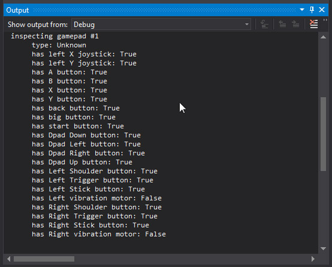
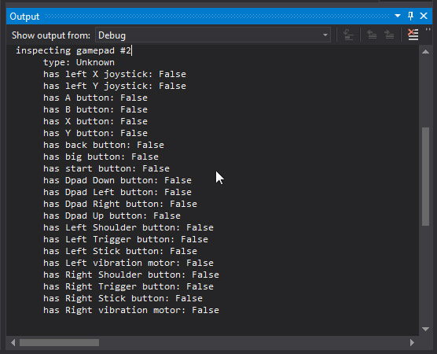

# Supported Controllers


In this article, we will examine what types of controllers are supported by MonoGame.

We will also create a function to inspect a connected controller's properties.

Let's get started.


### What is a Gamepad?


A Gamepad is a controller. In MonoGame controllers are referred to as gamepads.

Because MonoGame was built upon XNA, MonoGame supports Xbox360 controllers by default.

MonoGame also supports other types of controllers, but there is no official list of supported controllers.


However, you can check to see if MonoGame supports your controller through code.

Below we create a function called **InspectGamePad()**.

Add this function to InputHelper.cs.


```cs
public void InspectGamePad(int playerNum)
{
	GamePadCapabilities gpc = GamePad.GetCapabilities(playerNum);

	System.Diagnostics.Debug.WriteLine("inspecting gamepad #" + playerNum);
	System.Diagnostics.Debug.WriteLine("\t type: " + gpc.GamePadType);

	System.Diagnostics.Debug.WriteLine("\t has left X joystick: " + gpc.HasLeftXThumbStick);
	System.Diagnostics.Debug.WriteLine("\t has left Y joystick: " + gpc.HasLeftYThumbStick);

	System.Diagnostics.Debug.WriteLine("\t has A button: " + gpc.HasAButton);
	System.Diagnostics.Debug.WriteLine("\t has B button: " + gpc.HasBButton);
	System.Diagnostics.Debug.WriteLine("\t has X button: " + gpc.HasXButton);
	System.Diagnostics.Debug.WriteLine("\t has Y button: " + gpc.HasYButton);

	System.Diagnostics.Debug.WriteLine("\t has back button: " + gpc.HasBackButton);
	System.Diagnostics.Debug.WriteLine("\t has big button: " + gpc.HasBigButton);
	System.Diagnostics.Debug.WriteLine("\t has start button: " + gpc.HasStartButton);

	System.Diagnostics.Debug.WriteLine("\t has Dpad Down button: " + gpc.HasDPadDownButton);
	System.Diagnostics.Debug.WriteLine("\t has Dpad Left button: " + gpc.HasDPadLeftButton);
	System.Diagnostics.Debug.WriteLine("\t has Dpad Right button: " + gpc.HasDPadRightButton);
	System.Diagnostics.Debug.WriteLine("\t has Dpad Up button: " + gpc.HasDPadUpButton);

	System.Diagnostics.Debug.WriteLine("\t has Left Shoulder button: " + gpc.HasLeftShoulderButton);
	System.Diagnostics.Debug.WriteLine("\t has Left Trigger button: " + gpc.HasLeftTrigger);
	System.Diagnostics.Debug.WriteLine("\t has Left Stick button: " + gpc.HasLeftStickButton);
	System.Diagnostics.Debug.WriteLine("\t has Left vibration motor: " + gpc.HasLeftVibrationMotor);

	System.Diagnostics.Debug.WriteLine("\t has Right Shoulder button: " + gpc.HasRightShoulderButton);
	System.Diagnostics.Debug.WriteLine("\t has Right Trigger button: " + gpc.HasRightTrigger);
	System.Diagnostics.Debug.WriteLine("\t has Right Stick button: " + gpc.HasRightStickButton);
	System.Diagnostics.Debug.WriteLine("\t has Right vibration motor: " + gpc.HasRightVibrationMotor);
}
```	


The above function InspectGamePad() uses MonoGame's GamePad.GetCapabilities() method.

This collects all the available information about an attached controller.

Then we report on what kind of capabilities the controller has.


You could use this in your game to make sure an attached controller has the buttons your game requires.

Perhaps your game only requires the A button and a joystick?

Using the above method you can check for an A button and joystick, or alert the user their controller is unsupported.


If MonoGame doesn't recognize your controller, there's not much you can do.

This is likely due to the computer missing the controller's drivers.

The best thing you can do as a developer is to alert the player that their controller is unsupported.


### Using InspectGamePad()


Now that we've added a function to inspect an attached gamepad, let's update Game1.cs to check our controller.

Add the code below to Game1.Update(), near the end of the method.


Note that we are passing a value of 1 to the InspectGamePad() method.

This means InspectGamePad() is checking Player1's controller, but you may have multiple controllers attached.

Simply change the passed value to 1, 2, 3, or 4 to check different Player's controllers.


```cs
if (inputHelper.IsNewKeyPress(Keys.Enter)) { inputHelper.InspectGamePad(1); }
```	


Run your game by pressing F5, then press the Enter key.

You should see output similar to the image below.


<center></center>


If your controller is unsupported your output will probably look like this.


<center></center>


If the controller is unsupported, the best thing you can do is alert the player.


### Summary


You created a method in InputHelper to inspect a controller's capabilities.

You then added code to Game1.cs to inspect an attached controller.

Finally, you learned about how to inspect different attached controllers.


