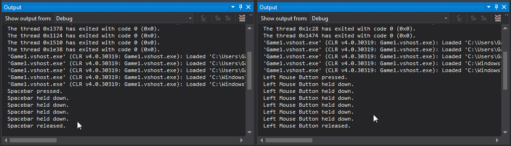

# Adding InputHelper to Game


In this article, we will add our InputHelper class to our Game class and check that it's working.

This article assumes that you have already [Created InputHelper.cs](InputHelperCreate.md).

Let's get started.


### Update Game1.cs


Open Game1.cs in the editor and replace it's code with the code below.


```cs
using Microsoft.Xna.Framework;
using Microsoft.Xna.Framework.Graphics;
using Microsoft.Xna.Framework.Input;

namespace Game1
{
    public class Game1 : Game
    {
        GraphicsDeviceManager graphics;
        SpriteBatch spriteBatch;
        InputHelper inputHelper;

        public Game1()
        { graphics = new GraphicsDeviceManager(this); Content.RootDirectory = "Content"; }

        protected override void Initialize() { base.Initialize(); }

        protected override void LoadContent()
        {
            spriteBatch = new SpriteBatch(GraphicsDevice);
            inputHelper = new InputHelper();
        }

        protected override void UnloadContent() { }

        protected override void Update(GameTime gameTime)
        {
            inputHelper.Update();

            if (inputHelper.IsNewKeyPress(Keys.Escape)) { Exit(); }

            //check keyboard for press, hold, release
            if (inputHelper.IsNewKeyPress(Keys.Space))
            { System.Diagnostics.Debug.WriteLine("Spacebar pressed."); }

            if (inputHelper.IsKeyDown(Keys.Space))
            { System.Diagnostics.Debug.WriteLine("Spacebar held down."); }

            if (inputHelper.IsNewKeyRelease(Keys.Space))
            { System.Diagnostics.Debug.WriteLine("Spacebar released."); }

            //check mouse for press, hold, release
            if (inputHelper.IsNewMouseButtonPress(MouseButtons.LeftButton))
            { System.Diagnostics.Debug.WriteLine("Left Mouse Button pressed."); }

            if (inputHelper.IsMouseButtonDown(MouseButtons.LeftButton))
            { System.Diagnostics.Debug.WriteLine("Left Mouse Button held down."); }

            if (inputHelper.IsNewMouseButtonRelease(MouseButtons.LeftButton))
            { System.Diagnostics.Debug.WriteLine("Left Mouse Button released."); }

            base.Update(gameTime);
        }

        protected override void Draw(GameTime gameTime)
        {
            GraphicsDevice.Clear(Color.CornflowerBlue);
            base.Draw(gameTime);
        }
    }
}
```	


Press F5 to build and run your game.

If you press the Escape key your game will close.

If you press the SpaceBar key, the output window will display the key's state, such as pressed, held down, and released.

If you press the Left MouseButton, the output window will display that button's state as well.

Your output window should look like the images below.


<center></center>


You are successfully tracking three states of keys and buttons: pressed, down, and released.

Notice that the output window has reported the **held down** state multiple times for both key and mouse button.

This is because InputHelper is checking the mouse state and keyboard state each frame.

Note that the **pressed** and **released** state was only reported once.

This is because the change occurred on that frame.


Imagine that you have a save button that saves your game.

Now imagine you were checking to see if the user clicked on that save button.

Would you check to see if the user clicked on the button? 

Or would you check to see if the user is pressing the button down?


If you checked to see if the save button is down, your game would save **each frame** the button is down!

That's unnecessary. We only need to check and see if the user clicked on the button once.

We can do this using **inputHelper.IsNewMouseButtonPress(MouseButtons.LeftButton)**.

That way your game only saves once, instead of saving every frame.


### Inspecting Game1.cs


Inside Game1.cs we define the instance of our inputHelper class.


```cs
InputHelper inputHelper;
```	


### Inspecting LoadContent()


Inside Game1.LoadContent(), we create our inputHelper instance.


```cs
protected override void LoadContent()
{
	spriteBatch = new SpriteBatch(GraphicsDevice);
	inputHelper = new InputHelper();
}
```	


### Inspecting Update()


Inside Game1.Update(), we use inputHelper to check various types of user input.

First, we check to see if the user pressed the Escape key.

This allows our game to close, or call Game1's Exit() method.


```cs
if (inputHelper.IsNewKeyPress(Keys.Escape)) { Exit(); }
```	


### Checking Keyboard Input


Continuing on inspecting Game1.Update(), we see a set of if statements that test inputHelper's functionality.

In these statements, we check to see if the user has pressed, is holding down, or has released the Spacebar key.

We could change the Spacebar key to a different key, such as the Enter key, or any other key we want.

We report on inputHelper's functionality using **System.Diagnostics.Debug.WriteLine()**.


```cs
//check keyboard for press, hold, release
if (inputHelper.IsNewKeyPress(Keys.Space))
{ System.Diagnostics.Debug.WriteLine("Spacebar pressed."); }

if (inputHelper.IsKeyDown(Keys.Space))
{ System.Diagnostics.Debug.WriteLine("Spacebar held down."); }

if (inputHelper.IsNewKeyRelease(Keys.Space))
{ System.Diagnostics.Debug.WriteLine("Spacebar released."); }
```	


### Checking Mouse Input


Continuing on inspecting Game1.Update(), we see more if statements that test inputHelper's functionality.

In these statements, we check to see if the user has pressed, is holding down, or has released the Left Mouse Button.

We could change the Left Mouse Button to the Right Mouse Button if we want to.


```cs
//check mouse for press, hold, release
if (inputHelper.IsNewMouseButtonPress(MouseButtons.LeftButton))
{ System.Diagnostics.Debug.WriteLine("Left Mouse Button pressed."); }

if (inputHelper.IsMouseButtonDown(MouseButtons.LeftButton))
{ System.Diagnostics.Debug.WriteLine("Left Mouse Button held down."); }

if (inputHelper.IsNewMouseButtonRelease(MouseButtons.LeftButton))
{ System.Diagnostics.Debug.WriteLine("Left Mouse Button released."); }
```	


### Using InputHelper


You can manage a variety of input states using clicks, holds, and releases.


For example, imagine you made a game with an inventory screen.

You want the user to be able to equip a new sword from their inventory.

You decide that the user should be able to drag the sword in inventory onto their character.


You can check to see if the user clicked on the sword using inputHelper.IsNewMouseButtonPress().

Then you can check to see if the user is dragging using inputHelper.IsMouseButtonDown().

Finally, you can check to see if the user dropped the sword on their character using inputHelper.IsNewMouseButtonRelease().


Remember that this also applies to keyboard input.

If your game's hero attacks via the Spacebar, then you may want to check to see if the Spacebar is down.

That way, the user can continually attack by holding the Spacebar down.

Or maybe you only want the hero to attack once each time the user presses the Spacebar button.


### Summary


You added an instance of InputHelper.cs to Game1.cs.

You added code to test InputHelper's methods.

You then tested InputHelper's methods to make sure they were working correctly.


