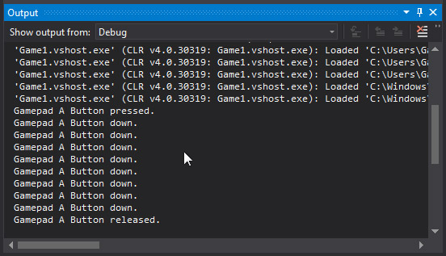
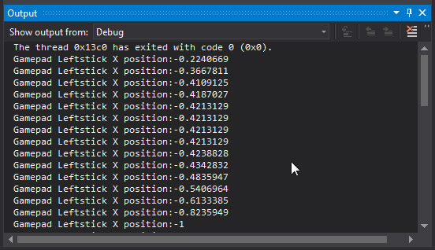

# Adding Gamepad Input


In this article, we will add Gamepad Input to our InputHelper class.

Then we will update Game1.cs to check any attached Gamepad for Button and Joystick Input.

This article assumes that you have completed 
[Creating InputHelper ](InputHelperCreate.md)
and 
[Adding InputHelper to Game](InputHelperAdd.md).

Let's get started.


### Update InputHelper.cs


For this article, we will be using a Microsoft Xbox360 Controller attached to your computer.

However, you can choose to use other types of controllers for your game's input.

Please see the article [Supported Controllers](GamepadsSupported.md) for more information.


Open InputHelper.cs and add the code below to the InputHelper class, after cursorPosition.


```cs
public GamePadState currentGamePadState = new GamePadState();
public GamePadState lastGamePadState = new GamePadState();
public Vector2 leftJoystickPosition = new Vector2(0, 0);
public Vector2 rightJoystickPosition = new Vector2(0, 0);
public Vector2 deadzone = new Vector2(0.1f, 0.1f); //amount of joystick movement noise to ignore
```	


Here we have defined several new class members to handle gamepad state.

Just like mouse and keyboard state, we defined a current and previous state for comparison purposes.

Note the three Vector2s we have declared.


The Vector2 leftJoystickPosition will be used to track the position of the gamepad's left joystick.

The Vector2 rightJoystickPosition will be used to track the position of the gamepad's right joystick.

The Vector2 deadzone will be used to ignore small changes in a joystick's movement from a neutral position.


A deadzone is used to combat drift from older controllers.

As controllers are used, overtime their joysticks can loosen and wiggle, changing the neutral position (0, 0).

We want to ignore this erroneous input, so we choose to discard any joystick values less than 0.1.


### Modify InputHelper.Update()


Next we want to modify InputHelper's Update method to track the joystick positions.

First we get the current gamepad's thumbstick positions and set them into our joystick position variables.

Then we check to see if our joystick position vectors are larger than 0.1.

If the joystick position vectors are smaller than 0.1, we set them equal to 0.


```cs
public void Update()
{
	lastKeyboardState = currentKeyboardState;
	lastMouseState = currentMouseState;
	lastGamePadState = currentGamePadState;

	currentKeyboardState = Keyboard.GetState();
	currentMouseState = Mouse.GetState();
	currentGamePadState = GamePad.GetState(PlayerIndex.One);

	//track cursor position as int
	cursorPosition.X = (int)currentMouseState.X;
	cursorPosition.Y = (int)currentMouseState.Y;

	//track gamepad's joysticks
	leftJoystickPosition = currentGamePadState.ThumbSticks.Left;
	rightJoystickPosition = currentGamePadState.ThumbSticks.Right;

	//check to make sure joysticks exceed deadzone, else ignore joystick's movement
	if (Math.Abs(leftJoystickPosition.X) < deadzone.X) { leftJoystickPosition.X = 0; }
	if (Math.Abs(leftJoystickPosition.Y) < deadzone.Y) { leftJoystickPosition.Y = 0; }
	if (Math.Abs(rightJoystickPosition.X) < deadzone.X) { rightJoystickPosition.X = 0; }
	if (Math.Abs(rightJoystickPosition.Y) < deadzone.Y) { rightJoystickPosition.Y = 0; }
}
```	


Note the use of **Math.Abs()**.

Math.Abs() takes a numerical parameter, like a float or integer, and returns that value as a positive value.

Why do we do this?


Well, a joystick's value can be between -1.0 and +1.0.

For example, when you push a joystick all the way to the left, it's X value will be -1.0.

When you push it all the way to the right, it's X value will be 1.0.


We use Math.Abs() to transform a joystick's negative value into a positive value.

Then we check to see if the positive value is greater than our deadzone value.

Using Math.Abs() allows us to only check the positive case and thus simplify our code.


### Add GamePad Helper Methods to InputHelper.cs


Now we want to add gamepad checking methods to InputHelper.

It's preferable they function similar to the mouse and keyboard methods.

This makes it easier to use InputHelper, because it's methods will be consistent.


Add the code below to InputHelper.cs


```cs
//check for gamepad button presses and releases
public bool IsNewButtonPress(Buttons button)
{ return (currentGamePadState.IsButtonDown(button) && lastGamePadState.IsButtonUp(button)); }

public bool IsButtonDown(Buttons button)
{ return currentGamePadState.IsButtonDown(button); }

public bool IsNewButtonRelease(Buttons button)
{ return (lastGamePadState.IsButtonDown(button) && currentGamePadState.IsButtonUp(button)); }
```	


We have created 3 new methods inside InputHelper: IsNewButtonPress(), IsButtonDown(), and IsNewButtonRelease().

Notice how similar these method names are to IsNewKeyPress(), IsKeyDown(), and IsNewKeyRelease().

If you compare these functions to their mouse and keyboard counterparts, you will see they function similarly.


All of InputHelper's methods are now consistently named.

For methods that have similar responsibilities, it's good practice to similarly name them.

Now let's update Game1.cs to check for gamepad input.


### Update Game1 to Test Gamepad Button Input


Now we need to modify Game1.Update() to check for gamepad button input.

We will do this similar to how we check keyboard and mouse input.

Copy the code below into Game1.Update(), after the mouse input checks.


```cs
//check gamepad for input
if (inputHelper.IsNewButtonPress(Buttons.A))
{ System.Diagnostics.Debug.WriteLine("Gamepad A Button pressed."); }

if (inputHelper.IsButtonDown(Buttons.A))
{ System.Diagnostics.Debug.WriteLine("Gamepad A Button down."); }

if (inputHelper.IsNewButtonRelease(Buttons.A))
{ System.Diagnostics.Debug.WriteLine("Gamepad A Button released."); }
```	


Run your game and press the A button on the connected Xbox 360 controller.

Your output window should look similar to the image below.


<center></center>


### Update Game1 to Test Gamepad Joystick Input


Now we need to modify Game1.Update() to check for gamepad joystick input.

We will want to write the position of the left joystick to the output window.


But we only want to report the left joystick's position if the joystick is beyond our dead zone.

We do this simply by checking if the X or Y position is equal to zero.

If the X or Y position isn't 0, then we know the user is intentionally moving the joystick.


Copy the code below into Game1.Update(), after the gamepad button input checks we just added.


```cs
//check gamepad left joystick for input
if (inputHelper.leftJoystickPosition.X != 0)
{ System.Diagnostics.Debug.WriteLine("Gamepad Leftstick X position:" + inputHelper.leftJoystickPosition.X); }

if (inputHelper.leftJoystickPosition.Y != 0)
{ System.Diagnostics.Debug.WriteLine("Gamepad Leftstick Y position:" + inputHelper.leftJoystickPosition.Y); }
```	


Run your game and move the left joystick to the left on the connected Xbox 360 controller.

Your output window should look similar to the image below.

Note the X value decreases from 0 to -1 as you move the joystick left.


<center></center>


### Summary


You updated InputHelper to check for a Xbox360's gamepad input.

You then updated Game1.cs to test for gamepad input.

You then tested InputHelper's new methods to make sure they were working correctly.


