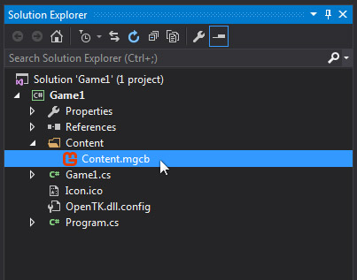

# Launching the Pipeline Tool

The Pipeline Tool can be opened by double clicking on the .mgcb file from inside your solution explorer.

It's recommended that you launch the pipeline tool using this method.

You can also locate the .mgcb file in your project directory and launch from there.

Launching the pipeline tool will provide you with a program interface like this:

With your project linked to the pipeline tool, you're ready to add and build your game content.

We explore how to add and build game content in the following articles:

- [Adding a Texture](TextureAdding.md) 
- [Adding a TrueType Font](FontAddingTrueType.md)
- [Adding a Bitmap SpriteFont](FontAddingSpritefont.md)
- [Adding Sounds](SoundAdding.md) 

