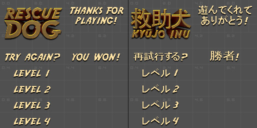

# Localization


In this article, we will discuss localization.

Let's get started.


### What is Localization?


Localization is the process of adapting a product or content to a specific locale or market. 

Translation is only one of several elements of the localization process. 

In addition to translation, the localization process may also include adapting graphics to a target market.


For the puposes of the example game RescueDog, we only need to do translation of in game text.


### Handling Multiple Languages


If you game has a lot of in-game text, then you'll want to display that text using a font.

You'll want to add a font to your content pipeline project that supports your target language.

Then you'll need to store each string of in-game text somewhere, along with it's translation.

Based on the player's selected language, you would then draw the appropriate string using the correct font.

This is generally the approach used by larger games, but it's pretty complicated.


For this getting started example, we're going to use a solution that is simple - but doesn't scale well.

If your game has a lot of in-game text, you don't want to use this solution.

RescueDog only has 8 unique strings of text in the game, so this solution works well in this case.

We're going to use a sprite sheet, instead of a font, to display our in-game text.


That means our in-game text will be handled using sprite objects.

This is easy to explain and simple to implement,  plus we don't need to load a language specific font.

We can also control how our text is displayed down to the pixel, because it's actually a texture.

Look at the english and japanese text sprite sheets the game uses below:


<center></center>


RescueDog is setup to use a texture named titleSheet for all in-game text sprites.

We simply need to tell the game to load a different texture in order to change all in-game text.

Open Game1.cs and navigate to the LoadContent() method.

Find the two lines as displayed below.


```cs
titleSheet = Content.Load<Texture2D>(@"English");
//titleSheet = Content.Load<Texture2D>(@"Japanese");
```	


Uncomment the line that loads the japanese texture, then comment out the line that loads the english texture.

Now the game will be displayed in japanese, including a japanese game logo in glorious pixel perfect 3d.

You just couldn't do that using a font based translation solution.


### Taking It Further


For now, I'm happy just to have RescueDog available in English and Japanese.

However, it's fairly straightforward to add support for another language.

Simply create a copy of the english sheet, then replace the text, making sure you match each text's position.

Add the new sheet into the content pipeline, or just replace the english sheet.

Build the content, then in Game1.cs either load the new sheet or load the english sheet you replaced.

That's it.


### Summary


In this article we looked at two techniques for handling translating in-game text.

We explored the technique used in RescueDog and discussed how to add additional languages to the game.


