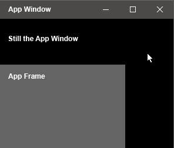

# Setting a UWP App's Window Size


This article discusses how to set the window (and frame) for a UWP App.

You may of noticed that UWP apps don't respond to the traditional Monogame way of setting the window's size.

We'll talk about why that happens, and how you can work around it.


### Windows and Frames


First we need to discuss the difference between what a Window and a Frame is, in the context of a UWP App.


A **Window** represents the re-sizable window the UWP App is currently running in.

A **Frame** represents a rectangle that your game is rendered to, inside of that Window.

By default the Frame is set to the same size as the Window, and scales to meet the Window's size.

Below shows a visual representation of the App Window and App Frame.


<center></center>


### Window Re-sizing can't be Disabled


Unlike DirectX or OpenGL projects, UWP Apps do not allow the programmer to disable window re-sizing.

UWP apps are expected to work across many devices and resolutions, which requires re-sizing the window.

You cannot prevent the user from re-sizing the UWP App's window, but you can control the size of your game's frame.


### Setting the Frame and Window Size


Locate the **App.xaml.cs** file in your project.

Navigate to the **OnLaunched()** function.

This is where we'll add code to control the size of the Frame and Window upon launch.

Inspect the code below, and integrate it into your function where appropriate.


```cs
Frame rootFrame = Window.Current.Content as Frame;

if (rootFrame == null)
{
	rootFrame = new Frame();

	rootFrame.Width = 1280;
	rootFrame.Height = 720;
	ApplicationView.PreferredLaunchViewSize = new Size(1280, 720);
	ApplicationView.PreferredLaunchWindowingMode = ApplicationViewWindowingMode.PreferredLaunchViewSize;

	rootFrame.NavigationFailed += OnNavigationFailed;
	if (e.PreviousExecutionState == ApplicationExecutionState.Terminated) { }
	Window.Current.Content = rootFrame;
}
```


In this code, we set the Window and Frame to a resolution of 1280 by 720.


### Resizing Behavior


If the window is made smaller than the frame, the frame anchors to the top left corner.

If the window is made larger than the frame, the frame automatically centers to the window.

You may want to dynamically change the size of the frame, based on the size of the window.

There are a variety of ways to do this, all of which are beyond the scope of this tutorial.


It's suggested that you match the window and frame size to the user's screen resolution.

This type of full screen approach is discussed in the article 
[Making the Game Fullscreen](Fullscreen.md).


