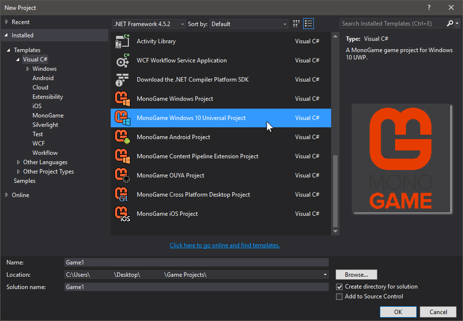
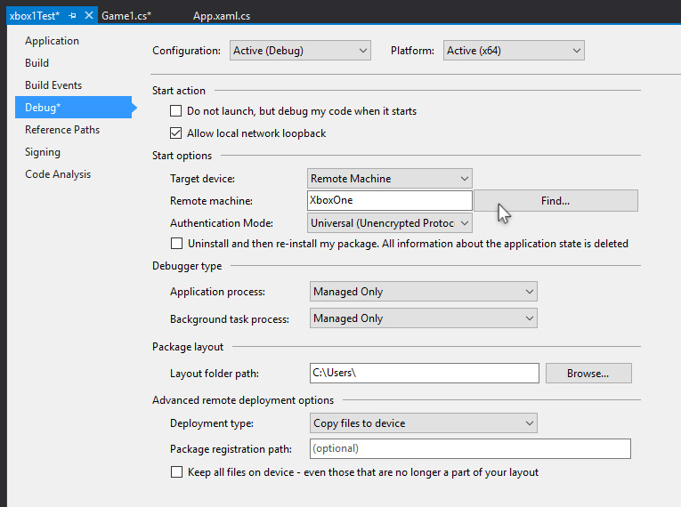
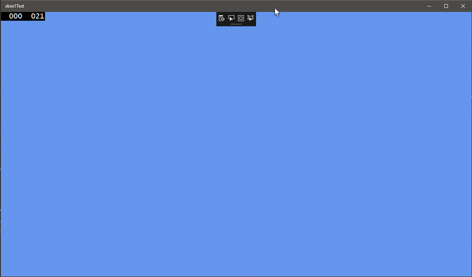
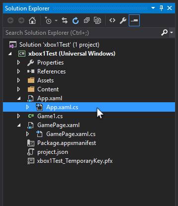

# Requirements for Deploying XBox One UWP Apps

This section discusses all the requirements for deploying UWP apps to an Xbox One console.

### Hardware Requirements

You will need:

- A Desktop PC
- A [Xbox One Console](http://www.xbox.com/en-US/xbox-one/consoles) (standard retail version)
- A Network connecting the PC and Xbox
- **Note**: a wired connection between the PC and Xbox allows faster deployment.

### Software Requirements

You will need:

- [Windows 10](https://www.microsoft.com/en-us/windows/get-windows-10) running on a PC
- [Visual Studio](https://www.visualstudio.com/vs/community/) 2015 or later
- Universal Windows App Development Tools (installed through Visual Studio)
- the [latest Windows 10 SDK](https://developer.microsoft.com/en-us/windows/downloads/windows-10-sdk) installed
- [Monogame (3.5+)](http://www.monogame.net/downloads/) installed

### Additional Requirements and Notes

You will also need a 
[Windows Creator or Developer account](https://docs.microsoft.com/en-us/windows/uwp/publish/opening-a-developer-account).

If you created a Windows Store Developer account, then you're good to go.

You **must** have a Windows Creator or Developer account to deploy UWP apps to a Xbox One Console.

[It only costs $20 to register as an Individual Developer](https://docs.microsoft.com/en-us/windows/uwp/publish/account-types-locations-and-fees).

This Developer account also lets you publish UWP apps to the Windows Store.

### The Deployment Process

Here is a link to the [official guide](https://docs.microsoft.com/en-us/windows/uwp/xbox-apps/getting-started).

Follow this guide up until you get to the section titled "Creating your first project in Visual Studio 2015", then stop.

Instead of creating a Universal Windows project, you will be creating a UWP Monogame Project.

After you create this project, you can continue to follow the official guide as normal.

Make sure you setup the project's properties correctly.

The first time you deploy to your Xbox One, Visual Studio will ask for a PIN.

You can get a PIN by starting Dev Home on your Xbox One and selecting the Pair with Visual Studio button.

Once paired and deployed (it may take a while for the first time), you'll see the familiar blue screen.

### Anatomy of a UWP Monogame Project

App.Xaml.cs loads GamePage.Xaml.cs.

GamePage.Xaml.cs instantiates the familiar Game1.cs.

You will probably never need to modify GamePage.Xaml.cs.

You will likely need to modify App.Xaml.cs.

App.Xaml.cs is kind of hidden in the project.

You need to locate App.xaml in the Solution Explorer, then click it's arrow icon on the left.

App.Xaml.cs will then be displayed below App.xaml.

Double-click to open this file for editing.

You may notice a few extra visual elements are displayed over the familiar blue screen.

You may or may not want these elements to be displayed.

We remove these in the UWP article [Cleaning Up](UWPCleanup.md).

