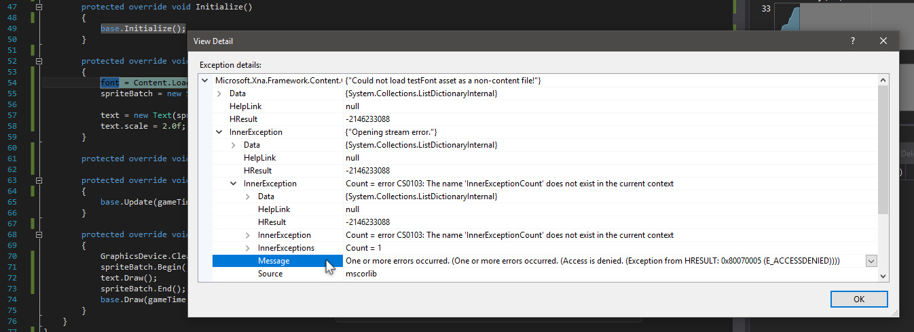
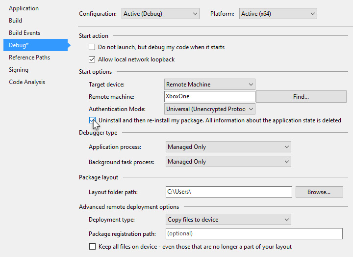

# Common Problems

This section discusses common problems you might run into when deploying UWP apps to your Xbox One.

Let's get started.

### Index of Common Problems

- **[Asset Loading Error](#AssetLoad)** - asset can't load as a non-content file.

<h3 id="AssetLoad">Asset Loading Error

**Problem Description:**

Sometimes when you deploy your UWP app to the Xbox One, an exception is thrown related to loading your asset as a non-content file.

First, make sure your asset file is in the proper directory.

Second, make sure the address to your asset file is correct.

Third, check that your app runs correctly on your local machine.

If you deploy to your local machine and the app works, deploy the app to the Xbox One again.

If the exception still occurs, inspect the exception information provided by the debugger.

You'll likely find an "Access is Denied" description, plus an error code.

**Problem Solution:**

Open your project settings and check the box marked "Uninstall and then re-install my package...", then re-deploy.

