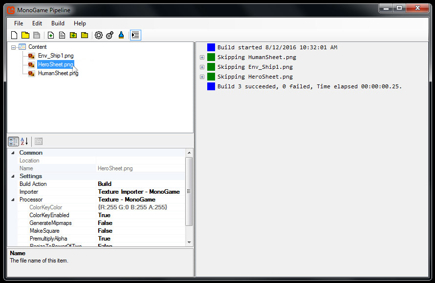

# What is the Pipeline Tool?

Monogame's Pipeline Tool is a program that converts game assets to XNB files.

For example, the pipeline tool could convert your Hero PNG texture to a XNB file, which Monogame could then load.

The pipeline tool also creates .mgcb files, which are linked to Monogame projects and manage the building of game content.

When you create a Monogame from a template project, a .mgcb file is automatically added.

Double clicking or launching this .mgcb file will open the pipeline tool and allow you to add, remove, or modify your game content.

**You do not need to manually copy game content into your content folder.**

Previously, XNA required that you copy content and then manually add it to your project.

This is no longer required, as the pipeline tool will handle that for you.

The pipeline tool was created and is developed by the Monogame team.

### What file formats are supported?

The Pipeline Tool can convert many formats into XNB.

Here is an incomplete list of all the formats supported:

**Textures:** png, jpg, dds, etc...

**Sounds:** wav, ogg, mp3, aiff

**3D Meshes:** fbx, obj

**Fonts:** TrueType, SpriteFonts(BMP)

**Data:** XML documents

**Effects:** Effects, SpriteEffects

### My file format isn't supported...

If you have an unsupported format, it is recommended that you convert it to a supported format.

If this is impossible, then you will need to write a custom content importer for Monogame.

Such a process is beyond the scope of this "Getting Started" documentation.

You should refer to the Monogame community for advice on how to proceed.

