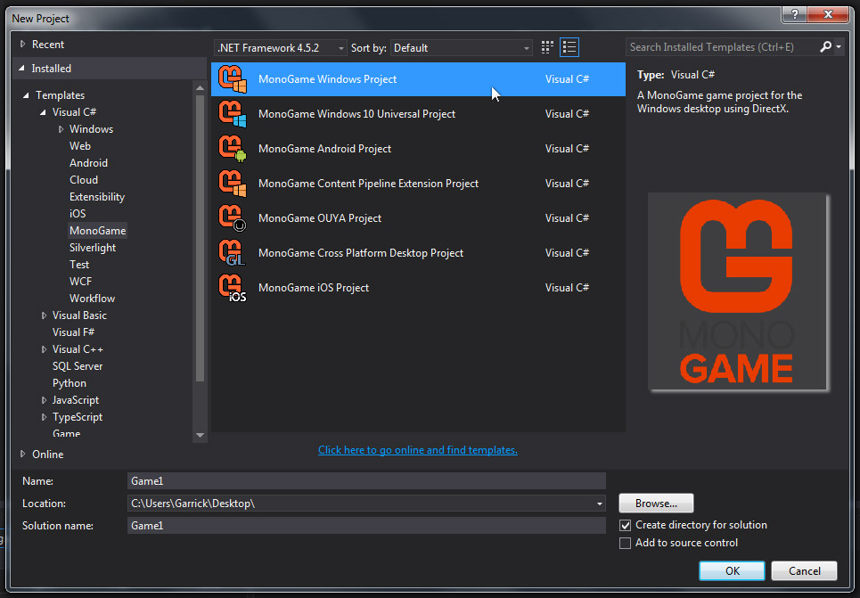

# Platforms and Project Types

### Platforms

A **platform** is a device plus it's software environment.

A home PC running Windows7 is a platform. 

A smart phone running Android is a platform.

A Playstation 4 console running Orbis OS is a platform.

Monogame supports a variety of platforms.

Coming soon, Monogame will even support the 
[Nintendo Switch](http://nintendoeverything.com/monogame-software-is-compatible-with-switch/).

In order to develop for certain platforms, you may be required to download and install additional software.

For example, in order to develop UWP apps/games for Xbox One, you must use Visual Studio.

You must be using Windows 10 as well, and have access to an Xbox One console.

In addition, you must install the Universal Windows App Development Tools.

Finally, you must install the latest Windows 10 SDK.

### Project Types

Monogame projects can target different platforms.

Different platforms require different libraries and backends to run.

A **project type** tells Monogame which platform it's targeting, and the libraries it needs to use.

For example, a Monogame 3.6 Desktop OpenGL project will now use SDL2 for the backend.

A Monogame 3.6 Desktop OpenGL project will also use OpenAL to play sounds.

You may be required to also install OpenAL to test your OpenGL project.

This means that anyone who plays your game will also need OpenAL.

### Templates

A **template** allows an IDE to create a project targeted at a specific platform.

A project is a series of files that describe the program, and let the IDE know what libraries to use.

The libraries a project requires to run are also known as **dependencies**.

Each project or template has different dependencies based on the platform it targets.

To view the available templates, launch a supported IDE with Monogame installed.

### Supported Platforms

- iOS
- OS X
- Android
- Linux
  
- BSD
- Windows Phone 8
- Windows Store
- Windows Desktop
  
- Windows 10
- PlayStation 4
- PlayStation Vita
- Xbox One
  
- Nintendo Switch (coming soon)

**Note**: as of MonoGame 3.6, OUYA support has been removed.

