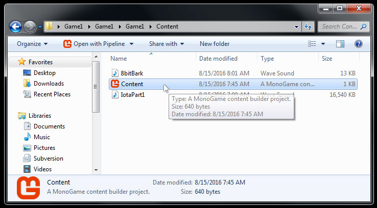
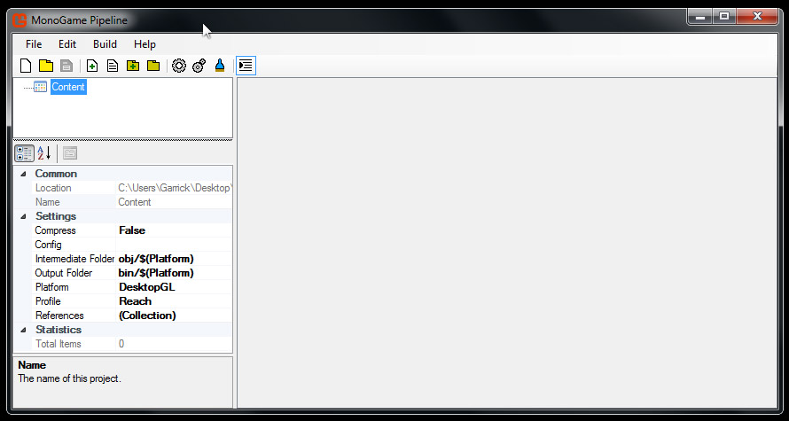
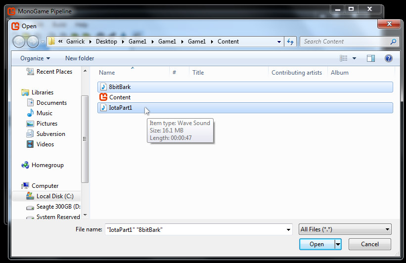
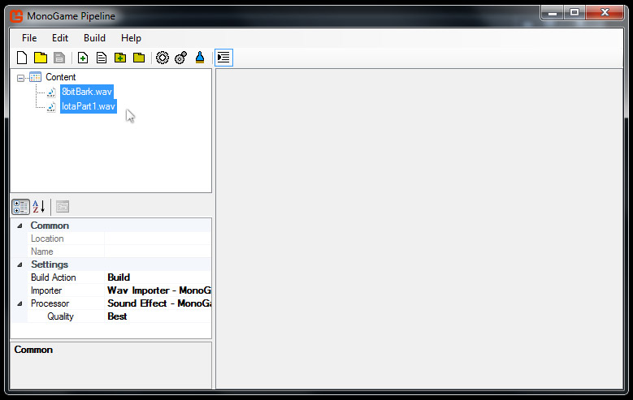
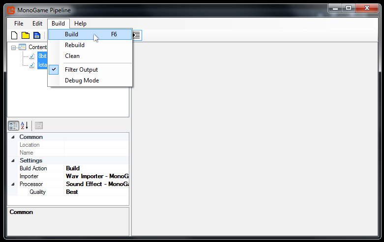
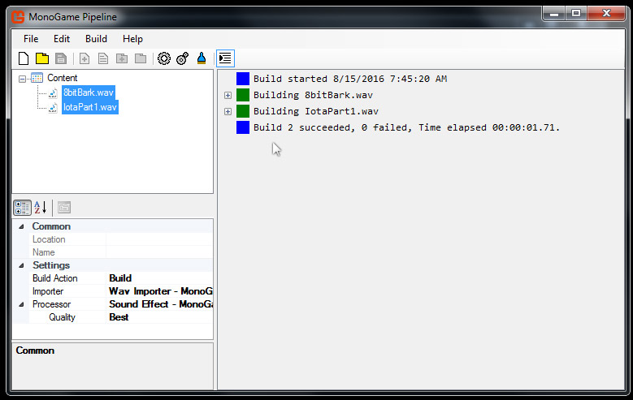
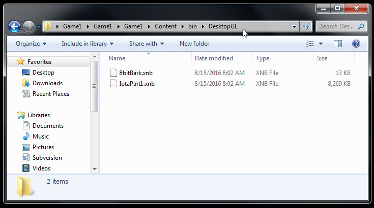

# Adding Sounds

In this article, we will add background music and a sound effect to your game's pipeline tool, and build the assets into a XNBs. 

This article assumes that you have already [Built A MonoGame Project](BuildingFirstProject.md).

Let's get started.

### Copy the Sound Assets

First, you'll need to download the two sound files below.

The first sound "IotaPart1.wav" is a track of music that we will use as looping background music.

The second sound "8bitBark.wav" is a sound effect that we will play when the spacebar is pressed.

Right click each link and choose 'Save As...' then save it to your project's Content folder.

Make sure the sounds have the .WAV file extension.

[IotaPart1.wav](../Assets/IotaPart1.wav)

[8bitBark.wav](../Assets/8bitBark.wav)

### Launch the Pipeline Tool

Navigate to your project's Content folder and double click on Content.mgcb.

The pipeline tool will open. 

Note that you have opened your game's .mgcb file, which is linked to your game project.

You will start with an empty pipeline window like below.

### Add the Sound Assets

Now we will add our downloaded sound files to the pipeline tool.

Click Edit > Add > Existing Item...

Locate the downloaded sounds in the file browser.

Select both sound files, then click the 'open' button.

Now your content pipeline window should look like below.

These sound files will default to being imported as SoundEffects.

This information can be found in the lower left hand corner of the pipeline window.

Note the Build Action, Importer, Processor, and Quality settings.

### Build the Pipeline Assets

Now let's build our sounds to XNB files.

Click Build > Build, or press F6.

The results of building should look like below.

Note that two additional folders have been added to your Content folder, **bin** and **obj**.
Don't worry too much about understanding why these folders exist right now.
You do need to know that the XNBs that were built exist in the **bin** folder.
My project is a Windows OpenGL project, so my XNBs are located at **/bin/DesktopGL**.
Navigate to your XNB files and inspect their properties. 
You can see that the WAV files were transformed into XNBs with the same name.

### Summary

Your sound assets are now ready to be loaded into your game and played.

We'll cover this in the next article [Playing Sounds](SoundPlaying.md).

