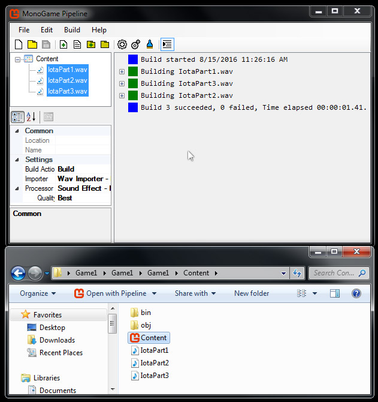

# Layering Sounds


In this article, we will layer 3 sound files together to create dynamic game music. 

This article assumes that you have completed all the other Sound tutorials.

This article starts with a new MonoGame project, created in the article 
[Building A MonoGame Project](BuildingFirstProject.md).

Let's get started.


### Download the Sound Files


First, you'll need to download the three sound files below.

Each sound file represents a part of the complete song "Iota".


IotaPart1 represents the main progression of the song.

IotaPart2 represents a melody played over the main progression, with a different instrument.

IotaPart3 is a drum track that matches the tempo of the progression and melody parts.


Right click each link and choose 'Save As...' then save it to your project's Content folder.

Make sure the sounds have the .WAV file extension.


<center>[IotaPart1.wav](../Assets/IotaPart1.wav)</center>

<center>[IotaPart2.wav](../Assets/IotaPart2.wav)</center>

<center>[IotaPart3.wav](../Assets/IotaPart3.wav)</center>


### Add the Music Tracks to Your Project Using the Pipeline Tool


Locate the .WAV files, add them to the pipeline tool, and build the pipeline project.

Your Content folder and pipeline project should look like the image below.

Refer to the [Adding Sounds](SoundAdding.md) article if you are unfamiliar with how to add project assets.


<center></center>


### Update Game1.cs


Replace Game1's code with the code below.


```cs
using Microsoft.Xna.Framework;
using Microsoft.Xna.Framework.Graphics;
using Microsoft.Xna.Framework.Input;

using Microsoft.Xna.Framework.Audio;

namespace Game1
{
    public class Game1 : Game
    {
        GraphicsDeviceManager graphics;
        SpriteBatch spriteBatch;

        SoundEffect IotaPart1;
        SoundEffect IotaPart2;
        SoundEffect IotaPart3;

        SoundEffectInstance IotaPart1Instance;
        SoundEffectInstance IotaPart2Instance;
        SoundEffectInstance IotaPart3Instance;

        bool playPart1 = true;
        bool playPart2 = true;
        bool playPart3 = true;

        float fadeSpeed = 0.01f;

        public Game1()
        {
            graphics = new GraphicsDeviceManager(this);
            Content.RootDirectory = "Content";
        }

        protected override void Initialize() { base.Initialize(); }

        protected override void LoadContent()
        {
            spriteBatch = new SpriteBatch(GraphicsDevice);

            IotaPart1 = Content.Load<SoundEffect>("IotaPart1");
            IotaPart2 = Content.Load<SoundEffect>("IotaPart2");
            IotaPart3 = Content.Load<SoundEffect>("IotaPart3");

            IotaPart1Instance = IotaPart1.CreateInstance();
            IotaPart2Instance = IotaPart2.CreateInstance();
            IotaPart3Instance = IotaPart3.CreateInstance();

            IotaPart1Instance.IsLooped = true;
            IotaPart2Instance.IsLooped = true;
            IotaPart3Instance.IsLooped = true;

            IotaPart1Instance.Play();
            IotaPart2Instance.Play();
            IotaPart3Instance.Play();
        }

        protected override void UnloadContent() { }

        public void FadeTrack(bool TrackState, SoundEffectInstance MusicTrack)
        {
            if (TrackState) //the music track should be heard
            { if (MusicTrack.Volume < 1.0f) { MusicTrack.Volume += fadeSpeed; } }
            else //the music track should not be heard
            { if (MusicTrack.Volume > 0.01f) { MusicTrack.Volume -= fadeSpeed; } }
        }

        protected override void Update(GameTime gameTime)
        {
            //qwe keys play parts 123
            if (Keyboard.GetState().IsKeyDown(Keys.Q)) { playPart1 = true; }
            if (Keyboard.GetState().IsKeyDown(Keys.W)) { playPart2 = true; }
            if (Keyboard.GetState().IsKeyDown(Keys.E)) { playPart3 = true; }

            //asd keys mute parts 123
            if (Keyboard.GetState().IsKeyDown(Keys.A)) { playPart1 = false; }
            if (Keyboard.GetState().IsKeyDown(Keys.S)) { playPart2 = false; }
            if (Keyboard.GetState().IsKeyDown(Keys.D)) { playPart3 = false; }

            FadeTrack(playPart1, IotaPart1Instance);
            FadeTrack(playPart2, IotaPart2Instance);
            FadeTrack(playPart3, IotaPart3Instance);

            base.Update(gameTime);
        }

        protected override void Draw(GameTime gameTime)
        {
            GraphicsDevice.Clear(Color.CornflowerBlue);
            base.Draw(gameTime);
        }
    }
}
```	


There shouldn't be any errors in your project.

Build the project. You should see a blue screen.

Music will start playing.


If you press the A key, track 1 will fade out.

If you press the S key, track 2 will fade out.

If you press the D key, track 3 will fade out.


If you press the Q key, track 1 will fade in.

If you press the W key, track 2 will fade in.

If you press the E key, track 3 will fade in.


Play around with these controls, listening to the tracks fade in and out.


### Inspect Game1.cs


Lets inspect the changes we made to Game1.cs.

First, since we are using sound files, we need to tell Game1.cs where to find Monogame's sound classes.

This is done by the code below, which essentially 'imports' the audio classes defined in the Xna Framework.

Recall that Monogame is based on XNA.


```cs
using Microsoft.Xna.Framework.Audio;
```		


### SoundEffects, SoundEffectInstances, and Control Booleans


Recall that a SoundEffect loads a sound file, and a SoundEffectInstance controls a sound file.

Inside Game1.cs we create three SoundEffects and three SoundEffectInstances.

We also create three booleans to control if a SoundEffectInstance should be heard or should be muted.

Finally, we create a float value to control how quickly the game should fade a sound in or out.


```cs
SoundEffect IotaPart1;
SoundEffect IotaPart2;
SoundEffect IotaPart3;

SoundEffectInstance IotaPart1Instance;
SoundEffectInstance IotaPart2Instance;
SoundEffectInstance IotaPart3Instance;

bool playPart1 = true;
bool playPart2 = true;
bool playPart3 = true;

float fadeSpeed = 0.01f;
```	


### Inspect LoadContent()


In the LoadContent method we load the song parts into our ContentManager.

We set the SoundEffect variables to equal our loaded content.

Then we create the SoundEffectInstances that will control our sound files.


Note that we set each song part to loop. 

This ensures the song parts always stay synchronized with each other.

Part1 is 8 bars long, while Part3 is 16 bars long. Part3 is 1 bar long.


Also note that we start playing all the song parts at the same time.


```cs
protected override void LoadContent()
{
	spriteBatch = new SpriteBatch(GraphicsDevice);

	IotaPart1 = Content.Load<SoundEffect>("IotaPart1");
	IotaPart2 = Content.Load<SoundEffect>("IotaPart2");
	IotaPart3 = Content.Load<SoundEffect>("IotaPart3");

	IotaPart1Instance = IotaPart1.CreateInstance();
	IotaPart2Instance = IotaPart2.CreateInstance();
	IotaPart3Instance = IotaPart3.CreateInstance();

	IotaPart1Instance.IsLooped = true;
	IotaPart2Instance.IsLooped = true;
	IotaPart3Instance.IsLooped = true;

	IotaPart1Instance.Play();
	IotaPart2Instance.Play();
	IotaPart3Instance.Play();
}
```	


### Inspect the New Method FadeTrack()


Here we have created a new method for Game1.cs called FadeTrack().

Inside of FadeTrack's parentheses we see there are two variables. 

This means the method we have created accepts two parameters, a Boolean and a SoundEffectInstance.


The Boolean value is named TrackState.

The SoundEffectInstance is named MusicTrack.

We use these two variables to determine if the we should fade the MusicTrack's volume up or down.


If TrackState equals true, we fade the MusicTrack's volume up to 1.0.

If TrackState equals false, we fade the MusicTrack's volume down to 0.01.

We pass our musical parts to this method, where they will be faded based on the boolean value we pass.


```cs
public void FadeTrack(bool TrackState, SoundEffectInstance MusicTrack)
{
	if (TrackState) //the music track should be heard
	{ if (MusicTrack.Volume < 1.0f) { MusicTrack.Volume += fadeSpeed; } }
	else //the music track should not be heard
	{ if (MusicTrack.Volume > 0.01f) { MusicTrack.Volume -= fadeSpeed; } }
}
```	


### Inspect Update()


Finally, we modified Update() to check the keyboard for user input.

Based on the keys the user presses, we flip our control booleans on or off.

Remember, these booleans represent if a part should be playing or muted.


Once we have set our boolean values, we then pass each boolean to our FadeTrack() method.

We also pass the corresponding SoundEffectInstance representing that musical part.


```cs
protected override void Update(GameTime gameTime)
{
	//qwe keys play parts 123
	if (Keyboard.GetState().IsKeyDown(Keys.Q)) { playPart1 = true; }
	if (Keyboard.GetState().IsKeyDown(Keys.W)) { playPart2 = true; }
	if (Keyboard.GetState().IsKeyDown(Keys.E)) { playPart3 = true; }

	//asd keys mute parts 123
	if (Keyboard.GetState().IsKeyDown(Keys.A)) { playPart1 = false; }
	if (Keyboard.GetState().IsKeyDown(Keys.S)) { playPart2 = false; }
	if (Keyboard.GetState().IsKeyDown(Keys.D)) { playPart3 = false; }

	FadeTrack(playPart1, IotaPart1Instance);
	FadeTrack(playPart2, IotaPart2Instance);
	FadeTrack(playPart3, IotaPart3Instance);

	base.Update(gameTime);
}
```	


### Summary


You can now control what song parts are playing with the keyboard.

You should have an understanding of how to handle multiple SoundEffectInstances playing in sync with each other.

Using this basic approach, you can expand the code to adapt to conditions in your game.


For example, imagine the Hero in your game sees enemies approaching - you could fade the drums in.

Or you could fade in a different musical part of the song - a different melody or bassline.

When the enemies are defeated, you could fade the drums out and change back to the prior melody or bassline.


When a new level loads, you could load different musical parts - then fade between them based on level conditions.

This concept can even be applied to non-musical sounds.

Perhaps the level starts raining - you could then trigger the rain sound to fade in and loop.


**Note** - musical parts that share a tempo should start playing at the same time.

Stopping or Pausing a musical part will cause it to fall out of sync with the other musical parts.

Unless you are tracking a part's duration, it is difficult to determine when to re-sync musical parts.


