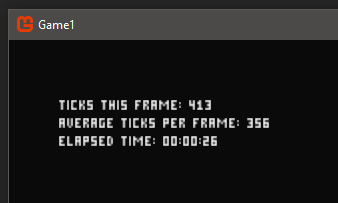

# The Blank Frame Test

This test times how long it takes to draw a blank monogame frame.

### Test Requirements

This test draws text to the screen, using a sprite font.

Follow the [Adding A Bitmap SpriteFont article ](FontAddingSpritefont.md) 
to add a sprite font asset to an empty monogame project.

Replace the contents of Game1.cs with the source code provided 
**[here](../Assets/TimeTestBlankFrame.txt)**.

You may need to change the _Content.Load_ address to the sprite font you are using.

The source code will work for all project types.

### DirectX Test Results

This test was conducted using the [Mid-Range PC](TestingEnvironments.md).

With Debugging enabled:

After 10 minutes (36,000 frames), the average tick per frame was around **240**.

After 30 minutes (108,000 frames), the average tick per frame was around **245**.

Without Debugging enabled:

After 10 minutes (36,000 frames), the average tick per frame was around **218**.

After 30 minutes (108,000 frames), the average tick per frame was around **217**.

**Note**: In this test, the debugger added about **20** ticks of overhead.

### OpenGL Test Results

This test was conducted using the [Mid-Range PC](TestingEnvironments.md).

Note that Monogame 3.6 uses SDL2 for OpenGL projects.

**
This test will be put on hold until specific issues can be resolved.

These issues skew the timing of the OpenGL test results and don't provide an accurate report.

**

### Windows10 UWP App Test Results

This test was conducted using the [Mid-Range PC](TestingEnvironments.md).

With Debugging enabled:

After 10 minutes (36,000 frames), the average tick per frame was around **473**.

After 30 minutes (108,000 frames), the average tick per frame was around **476**.

Without Debugging enabled:

After 10 minutes (36,000 frames), the average tick per frame was around **343**.

After 30 minutes (108,000 frames), the average tick per frame was around **344**.

**Note**: In this test, the debugger added about **130** ticks of overhead.

### Xbox One UWP App Test Results

This test was conducted using the [Standard Xbox One Console](TestingEnvironments.md).

Note that UWP apps dont get access to the full power of the xbox hardware.

UWP apps share resources with other running applications.

With Debugging enabled:

After 10 minutes (36,000 frames), the average tick per frame was around **4180**.

After 30 minutes (108,000 frames), the average tick per frame was around **4150**.

Without Debugging enabled:

After 10 minutes (36,000 frames), the average tick per frame was around **3490**.

After 30 minutes (108,000 frames), the average tick per frame was around **3490**.

**Note**: In this test, the debugger added about **650** ticks of overhead.

