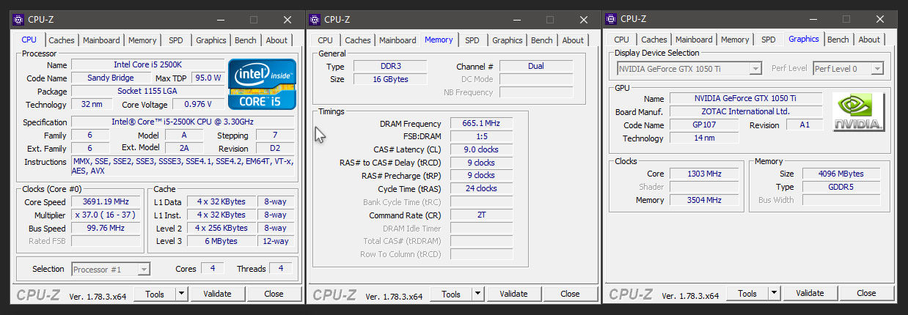

# Testing Environments

All the timing tests presented in this guide were tested using Monogame 3.6, on the following systems.

### Mid-Range PC

This refers to a PC using an Intel i5-2500K Quad-core @ 3.3GHz. 

Additional system information is provided below.

### Xbox One Home Console

The standard Xbox One home console uses an AMD "Jaguar" APU.

The APU has two quad-core modules totaling 8 cores clocked at 1.75 GHz.

[Additional system information is available here.](https://en.wikipedia.org/wiki/Xbox_One)

