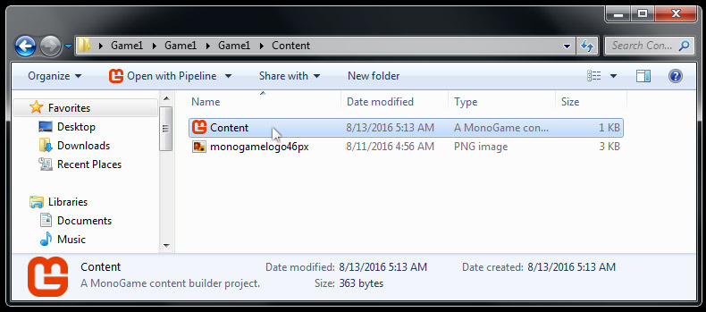
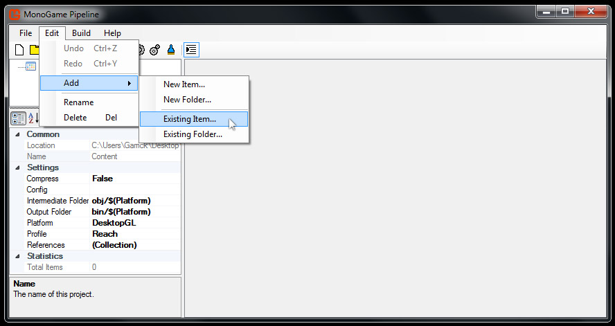
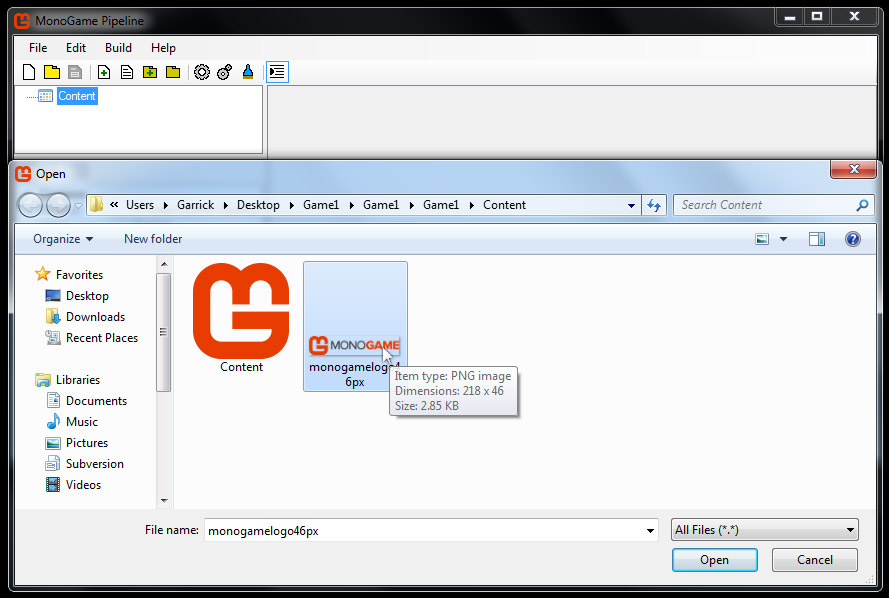
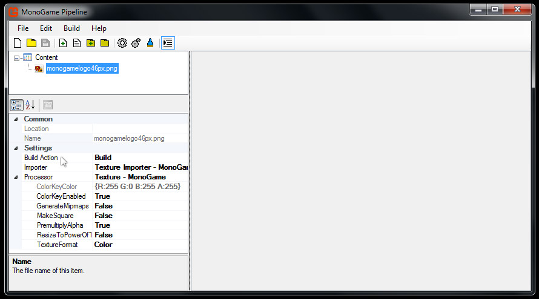
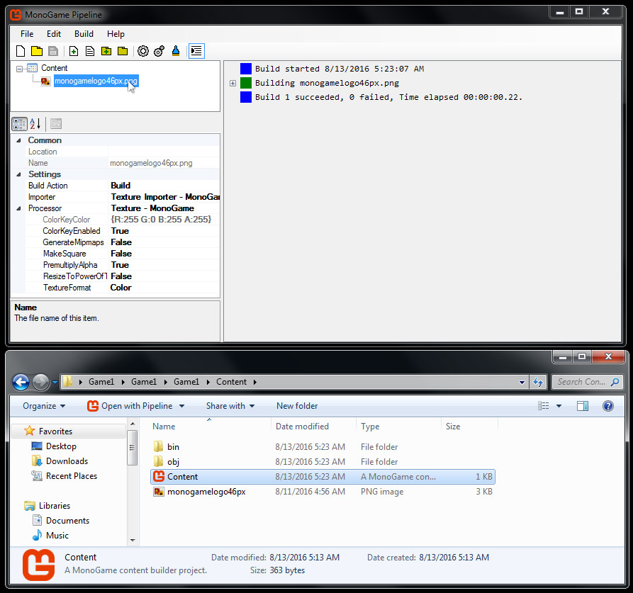
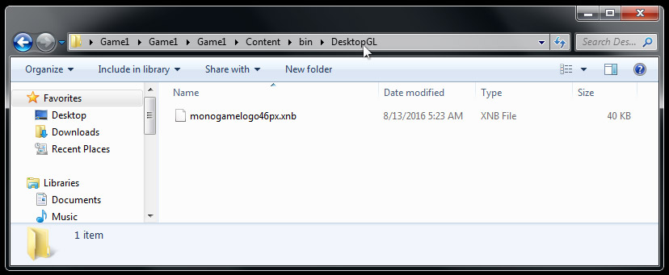

# Adding a Texture

In this article, we will add a texture asset to your game's pipeline tool, and build the asset into a XNB. 

This article assumes that you have already [Built A MonoGame Project](BuildingFirstProject.md).

Let's get started.

### Copy the Image Asset

First, you'll need to download the image below. 

Right click the image and choose 'Save As...' then save it to your project's Content folder.

Note that this image is a PNG file and has transparent pixels.

### Launch the Pipeline Tool

Navigate to your project's Content folder and double click on Content.mgcb.

The pipeline tool will open. 

Note that you have opened your game's .mgcb file, which is linked to your game project.

You will start with an empty pipeline window like below.

### Add the Image Asset

Now we will add our downloaded image to the pipeline tool.

Click Edit > Add > Existing Item...

Locate the downloaded image in the file browser.

Double click the image, or click the 'open' button.

Now your content pipeline window should look like below.

### Build the Pipeline Assets

Note the 'Build Action' in the 'Settings' section. 

This tells the pipeline tool how to build your game asset. 

This should default to 'Build' and the Importer setting should default to 'Texture'.

Now let's build our texture to a XNB file.

Click Build > Build, or press F6.

The results of building should look like below.

Note that two additional folders have been added to your Content folder, **bin** and **obj**.
Don't worry too much about understanding why these folders exist right now.
You do need to know that the XNB that was built exists in the **bin** folder.
My project is a Windows OpenGL project, so my XNB is located at **/bin/DesktopGL**.
Navigate to your XNB file and inspect it's properties. 
You can see that the PNG was transformed into a XNB with the same name.

### Summary

Your texture asset is now ready to be loaded into your game and drawn to the screen.
We'll cover this in the next article [Drawing a Texture](TextureDrawing.md).

