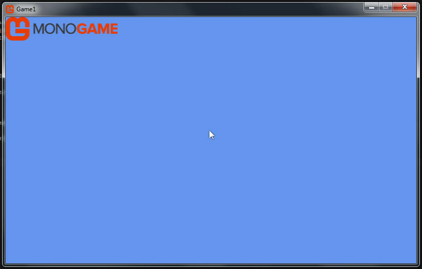

# Drawing a Texture


In this article, we will draw a XNB texture to our game window.

This article assumes you have completed [Adding a Texture](TextureAdding.md).

Let's get started.


### Change Game1.cs


Replace Game1's code with the code below.


```cs
using Microsoft.Xna.Framework;
using Microsoft.Xna.Framework.Graphics;
using Microsoft.Xna.Framework.Input;

namespace Game1
{
    public class Game1 : Game
    {
        GraphicsDeviceManager graphics;
        SpriteBatch spriteBatch;

        Texture2D texture;
        Vector2 position;
        Rectangle drawRec;
        float alpha = 1.0f;
        float rotation = 0.0f;
        Vector2 origin = new Vector2(0,0);
        float scale = 1.0f;
        SpriteEffects spriteEffect = SpriteEffects.None;
        float zDepth = 0.1f;

        public Game1()
        {
            graphics = new GraphicsDeviceManager(this);
            Content.RootDirectory = "Content";
        }
        protected override void Initialize() { base.Initialize(); }

        protected override void LoadContent()
        {
            this.IsMouseVisible = true;
            spriteBatch = new SpriteBatch(GraphicsDevice);
            texture = Content.Load<Texture2D>(@"monogamelogo46px");
            drawRec = new Rectangle(0, 0, texture.Width, texture.Height);
            position = new Vector2(0,0);
        }
        protected override void UnloadContent() {}

        protected override void Update(GameTime gameTime)
        {
            if (Keyboard.GetState().IsKeyDown(Keys.Escape)) { Exit(); }
            base.Update(gameTime);
        }

        protected override void Draw(GameTime gameTime)
        {
            GraphicsDevice.Clear(Color.CornflowerBlue);
            spriteBatch.Begin();
            spriteBatch.Draw(   texture,
                                position,
                                drawRec,
                                Color.White * alpha,
                                rotation,
                                origin,
                                scale,
                                spriteEffect,
                                zDepth);
            spriteBatch.End();
            base.Draw(gameTime);
        }
    }
}

```


There shouldn't be any errors in your project.

Build the project. You should see a window like below.


<center></center>


### Inspect Game1.cs


Lets inspect the changes we made to Game1.cs. In the below section of code, 
we are declaring a Texture2D object, a Vector2 object, a Rectangle object, four 
float data types, and a SpriteEffect object. We will load our XNB texture into 
the Texture2D object. Then we will place our texture using the Vector2 
position, which has a X and Y property. 


Monogame wants to know what section of the texture we want to draw, so we use a Rectangle 
object to tell Monogame that we want to draw the entire texture. Then we create a float for 
alpha . Alpha will control the opaque pixels of the texture, while preserving the 
texture's transparent pixels. An alpha of 0 would be invisible, while an alpha of 1.0 would 
be fully visible, or non-transparent. 


Then we create a Vector2 known as origin. How this value us used is explained in
the article [Modifying a Texture](TextureModify.md).


Next we create a float for rotation. This value will determine how much the texture
is rotated in radians. Then we create a float for scale. Scale will 
control the size of the texture. A scale of 1.0 tells Monogame to draw the texture 
at a 1:1 ratio with the original. Then we declare a SpriteEffect, which allows us to 
change the texture in a variety of ways, but we aren't going to do anything just yet, 
so we set the SpriteEffect to None. 


Finally we declare a float to control the zDepth of the texture. Think of zDepth as the 
stacking order, or layer, of objects on the screen. Because we don't have any other objects to draw, 
right now the zDepth is unimportant. It's important to note how zDepth is layered. 
A texture with a zDepth of 0.999 draws **behind** a texture with a zDepth of 0.111.


```cs
Texture2D texture;
Vector2 position;
Rectangle drawRec;
float alpha = 1.0f;
float rotation = 0.0f;
Vector2 origin = new Vector2(0,0);
float scale = 1.0f;
SpriteEffects spriteEffect = SpriteEffects.None;
float zDepth = 0.1f;
```		


### Inspect LoadContent()


In the LoadContent method we actually load the texture into our ContentManager, called Content.


_Game.Content is looking for XNBs in the **game's Content folder**, and not the project's Content folder.

Please refer to the article [Project Content vs Game Content](ProjectGameContent.md)
if you are unfamiliar with the differences between project and game content._


We provide the name of the texture we want to load, in this case "monogamelogo46px".
Monogame automatically adds the .XNB file extension to this address when the asset is loaded.
The XNB file "monogamelogo46px" is loaded as a Texture2D into our variable "texture".


Next, we want to draw the entire texture, so we set drawRec's position at the texture's starting position (0,0),
then set drawRec's width and height equal to the textures width and height.
Finally, we define our variable "position" as a new Vector2 with a X of 0 and a Y of 0.


```cs
protected override void LoadContent()
{
	this.IsMouseVisible = true;
	spriteBatch = new SpriteBatch(GraphicsDevice);
	texture = Content.Load<Texture2D>(@"monogamelogo46px");
	drawRec = new Rectangle(0, 0, texture.Width, texture.Height);
	position = new Vector2(0,0);
}
```


### Inspect Draw()


Let's inspect our last method, Draw().
First, we clear the screen, removing anything previously drawn, and fill it with a blue color.
Then with an empty blue screen, we tell spriteBatch to Begin();
We must tell spriteBatch to Begin() before we can draw anything with spriteBatch.Draw();
Once the spriteBatch has begun, we then tell spriteBatch to draw our texture using the variables
we defined earlier in the class.


The draw call can be read like this: "Draw this texture, at this position, 
using this part of the texture, at this opacity, with this rotation, with this origin,
at this scale, with this sprite effect, at this zDepth".


Finally, we must close the spriteBatch via the End() method.
This is done with spriteBatch.End();


```cs
protected override void Draw(GameTime gameTime)
{
	GraphicsDevice.Clear(Color.CornflowerBlue);
	spriteBatch.Begin();
	spriteBatch.Draw(   
		texture,
		position,
		drawRec,
		Color.White * alpha,
		rotation,
		origin,
		scale,
		spriteEffect,
		zDepth
	);
	spriteBatch.End();
	base.Draw(gameTime);
}
```


### Summary


Your texture asset is now drawing to the screen. 

The next step is to modify the texture's position, color, rotation, scale, origin, and effect.

We'll cover this in the next article [Modifying a Texture](TextureModify.md).


