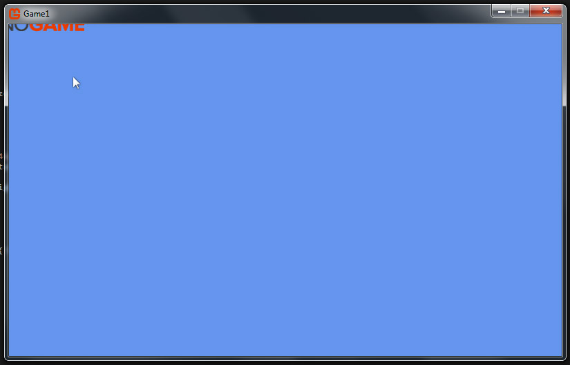
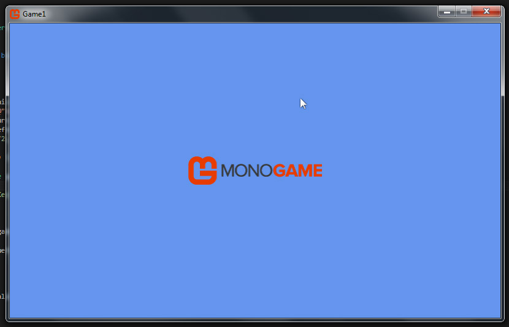
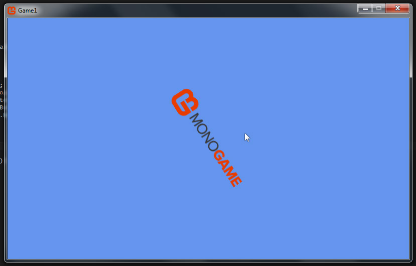
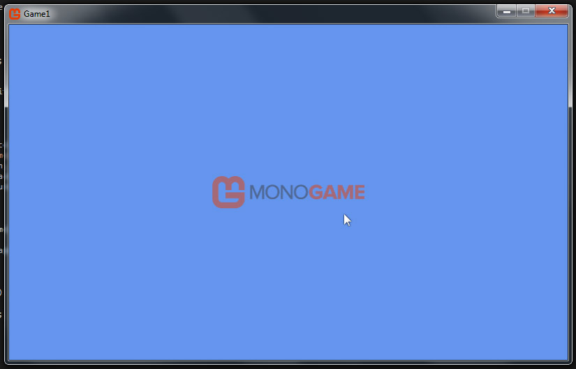
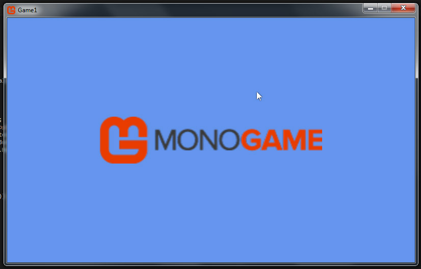
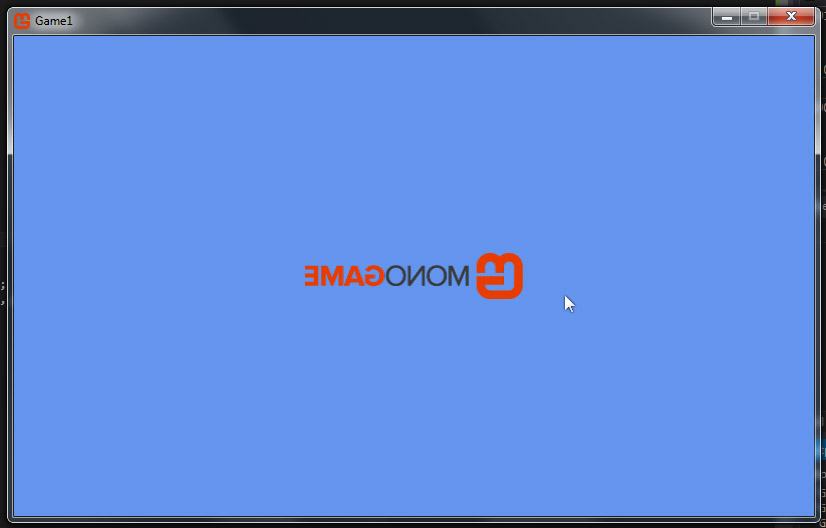

# Modifying a Texture


In this article, we will modify the appearance of our texture.

This article assumes you have completed [Drawing a Texture](TextureDrawing.md).

Let's get started.


### Understanding a Texture's Origin


First, let's discuss what a texture's origin is.


The origin of a texture can be thought of as the texture's pivot point.
If we were to change the rotation of the texture, it would rotate around the texture's (0,0) point.
This is because the origin is at (0,0).
If we centered the origin to the texture, then the texture would rotate "in place" around that center point.


But wait, there's more.
The origin also determines how the position value is applied to the texture.
The texture will be drawn at the position, but with the origin's offset.
Think of it like this: texturePosition = position - origin.
In order to better understand this, let's set the origin to the center of the texture in LoadContent().


```cs
protected override void LoadContent()
{
	this.IsMouseVisible = true;
	spriteBatch = new SpriteBatch(GraphicsDevice);
	texture = Content.Load<Texture2D>(@"monogamelogo46px");
	drawRec = new Rectangle(0, 0, texture.Width, texture.Height);
	position = new Vector2(0,0);
	origin = new Vector2(texture.Width/2, texture.Height/2);
}
```	


Now if you build the project, you'll see that the texture is being drawn centered to the position value of (0,0).


<center></center>


That looks pretty bad, so let's change it. 
Update your LoadContent() method to center the texture to the game's window.


```cs
protected override void LoadContent()
{
	this.IsMouseVisible = true;
	spriteBatch = new SpriteBatch(GraphicsDevice);
	texture = Content.Load<Texture2D>(@"monogamelogo46px");
	drawRec = new Rectangle(0, 0, texture.Width, texture.Height);
	position = new Vector2(graphics.PreferredBackBufferWidth / 2, graphics.PreferredBackBufferHeight / 2);
	origin = new Vector2(texture.Width/2, texture.Height/2);
}
```	


**graphics.PreferredBackBufferWidth** refers to the width of the game's window.

**graphics.PreferredBackBufferHeight** refers to the height of the game's window.

You can also get the game's window size from **Game.Window.ClientBounds.Width** and **Game.Window.ClientBounds.Height**.

We simply divide these values in half to calculate the center point of the game window.

Now build your game. Your window should look like the image below.


<center></center>


### Changing a Texture's Rotation

```cs
float rotation = 1.0f;
```	


Here we changed the rotation value from 0.0 to 1.0.
This float value represents the amount of Radians to apply to the texture.
A positive value is clockwise. A negative value is counter-clockwise.
The image below shows the results of modifying this rotation value.


<center></center>


### Changing a Texture's Opacity

```cs
float alpha = 0.5f;
```	


Here we change the alpha value from 1.0 to 0.5.
This means our texture will draw at 50% opacity, making it semi-transparent.
The image below shows the results of modifying this alpha value. 


<center></center>


### Changing a Texture's Scale

```cs
float scale = 2.0f;
```	


Here we change the scale value from 1.0 to 2.0.
This means our texture will draw at 200% size.
A value less than 1.0 would scale the texture down.
Note that this scale is applied from the origin point, so our texture stays centered to the game window
The image below shows the results of modifying this scale value. 


<center></center>


### Changing a Texture's SpriteEffect

```cs
SpriteEffects spriteEffect = SpriteEffects.FlipHorizontally;
```	


Here we change the spriteEffect enumerator value from SpriteEffects.None to SpriteEffects.FlipHorizontally.
This means our texture will be drawn horizontally flipped, or mirrored.
We could also change SpriteEffects.None to SpriteEffects.FlipVertically.
That would draw our texture flipped vertically.
The image below shows the results of modifying the SpriteEffects value. 


<center></center>


### Summary


You should now understand a texture's origin, position, rotation, alpha, scale, and SpriteEffects values.


