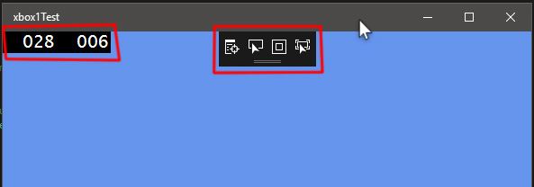
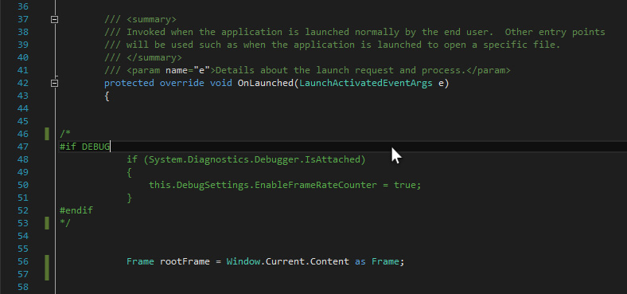
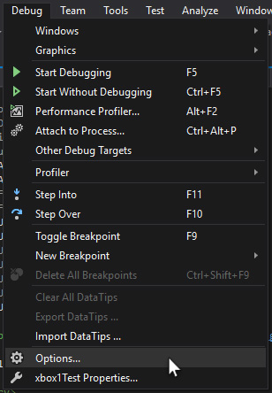
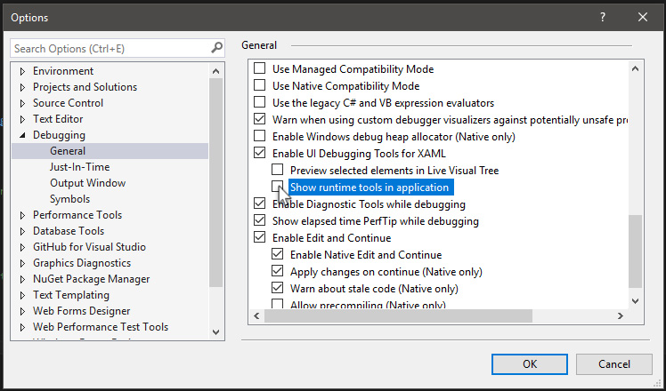
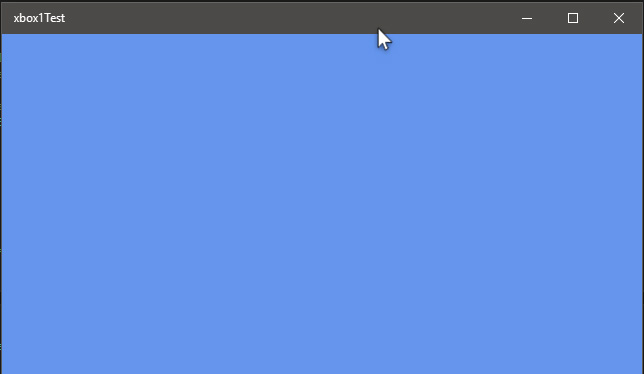

# Cleaning Up the Default UWP Project

This article discusses how to remove the UWP app frame counter and additional runtime tools.

If you're like me, you want to start your project with just a blank blue screen and nothing else.

### What do we need to clean up?

By clean up, I mean remove or disable.

Specifically, we want to remove the UWP frame counter and the runtime tools that overlay the blue screen.

These two elements are highlited below with a red outline.

### Removing the Frame Rate Counter

First, we'll get rid of the frame rate counter on the left.

Locate the section of code below in App.xaml.cs.

Comment the section of code out. Or delete it. Or set the value to be false.

### Removing the Runtime Tools

Next, we'll get rid of the runtime tools in the top middle.

Click on Debug > Options.

Then click on Debuging > General.

Uncheck the box labeled "Show runtime tools in application".

Exit the Options window, then run or deploy your game.

You should now be able to apply all the examples in this guide to your project.

There are some limitations for UWP apps that are running on the Xbox One.

These limitations are discussed in the article [UWP Limits](XboxUWPLimits.md).

