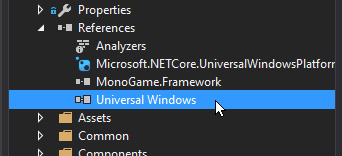

# Getting a UWP App's Used Memory


This article discusses how to get the amount of currently used memory in a UWP app.

It's useful to know how much memory is being used, due to the limits imposed on Xbox One UWP apps.

UWP apps use the **MemoryManager** to handle getting this data.


### Using MemoryManager


The MemoryManager provides access to information on an app's memory usage.

Official Documentation can be found [here](https://docs.microsoft.com/en-us/uwp/api/windows.system.memorymanager).


First, add a reference to Windows.System to your project.


<center></center>


Next, include the Windows.System namespace in your class or file.


```cs
using Windows.System;
```


Then you can access the app's memory useage like so:


```cs
System.Diagnostics.Debug.WriteLine(MemoryManager.AppMemoryUsage / 1024 / 1024 + " mb");
```


