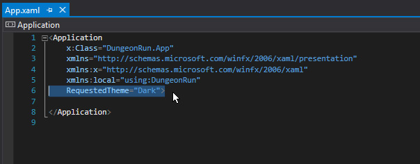

# Changing a UWP App's Theme

This article discusses how to change the Theme for a UWP app.

The theme sets a variety of colors, including the window's background color.

We'll do this by changing the App's RequestedTheme to **Light** or **Dark**.

Open your **App.xaml** file.

Notice the line **RequestedTheme="Dark"**.

There are two themes available by default, light and dark.

You can learn more about these two Themes 
[here](https://docs.microsoft.com/en-us/windows/uwp/style/color).

Light means your window will have a white background.

Dark means your window will have a black background.

If you'd like to use a custom theme for your UWP App, you can learn about how to do that 
[here](http://stackoverflow.com/questions/39533783/custom-themes-in-uwp-application).

